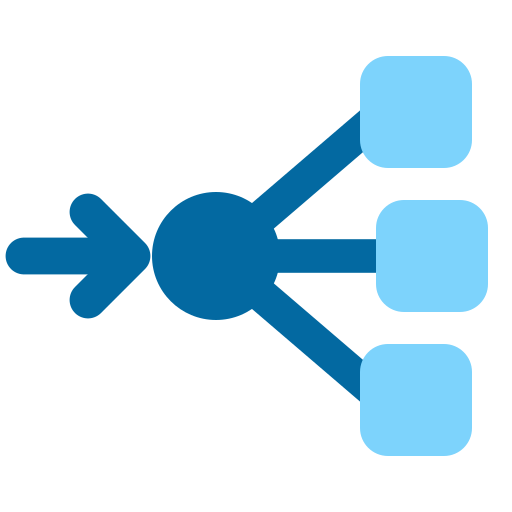

<!-- SPDX-FileCopyrightText: Ruben Talstra -->
<!-- SPDX-License-Identifier: BUSL-1.1 -->
#  FerroFED

An openEHR federation gateway, in pure Rust: where else the record is.

A record held by another organisation is out of reach today. FerroFED is a transparent ITS-REST intermediary: a client sends it an ordinary AQL query and never learns it was federated. The gateway resolves the patient first, through the index, so no directly identifying identifier travels in a query; then it sends standard AQL to each node, the local FerroEHR or a remote CDR, scoped to that node's own EHR id, and merges what comes back with each node's provenance. It holds no clinical data of its own. It follows the openEHR Federation Working Group's Federation Tier with AQL proposal.

FerroFED is one of the [FerroHEALTH](https://ferrohealth.eu/) family. The family
page shows where it sits among the eight and what calls what, and this
repository is where the design and the build happen; the tracker is the
record of both. Its site will be <https://ferrofed.eu/>.

## Licence

FerroFED is source-available under the Business Source License 1.1. The
parameters that apply, the Licensor, the Licensed Work, the Additional Use
Grant and the Change Date, are in [LICENSE](LICENSE): free for non-commercial
production use, a commercial licence for any other production use, and Apache
2.0 four years after each version is published. The maintainer named in
[MAINTAINERS.md](MAINTAINERS.md) is the contact for a commercial licence.

The brand assets under `assets/brand/` are part of the Licensed Work.
