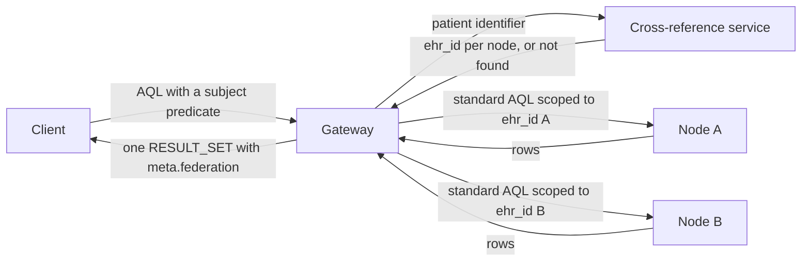

<!-- SPDX-FileCopyrightText: Vernum Projecten B.V. -->
<!-- SPDX-License-Identifier: BUSL-1.1 -->

# The Federation Tier with AQL

This page is a plain account of the specification FerroFED implements. It
cites the sections of the vendored text at
[`docs/specs/federation-spec/`](https://github.com/FerroHEALTH/FerroFED/tree/main/docs/specs/federation-spec)
and adds nothing of FerroFED's own; the next page does that.

## Three tiers

The specification adds a Federation Tier to openEHR querying, so that a client
can run one query across several openEHR CDRs as though they were a single
repository (§1). The system has three tiers (§3.1):

- the **application tier**, where a client sends AQL and reads the combined
  result;
- the **Federation Tier**, one or more gateways that act as the intermediary;
- the **node tier**, member CDRs that run ordinary openEHR queries scoped to a
  single EHR and need not know they belong to a federation.

The gateway is a technically transparent intermediary (§3.2). The client
interface is a conformant openEHR Query API, and a conformant ITS-REST surface
generally, so a basic patient query needs no federation-specific syntax.

## The flow

Federation keys on each node's local `ehr_id`. Patient identity is resolved
outside the query, and each node receives standard AQL scoped to its own
`ehr_id` (§4).

1. **The façade.** The client sends `POST {base}/v1/query/aql` and may
   identify the patient the openEHR way, with
   `WHERE e/ehr_status/subject/external_ref/id/value = <patientId>` (§4.1,
   §7).
2. **Resolution.** The gateway resolves the identifier to a set of
   `{node, ehr_id}` pairs through a localization service, a directory and an
   identifier cross-reference service. The proposed bindings are IHE XCPD,
   mCSD and PIXm (§4.1, §5, Annex A). Without a localization service the
   gateway asks every known node (§4.3).
3. **Fan-out.** Each node with a resolved `ehr_id` receives the node AQL: the
   subject predicate replaced by `e/ehr_id/value = '<resolved>'`, every other
   patient identifier removed or the query refused, and everything else
   forwarded unchanged (§7.1).
4. **Combine.** The gateway concatenates the rows, applies `DISTINCT` and
   `ORDER BY` across nodes, and reports every node it asked under
   `meta.federation.endpoints[]` with a status (§9, §11.1).

## What the specification insists on

- **No identifier leaves the gateway.** The patient identifier used for
  resolution is consumed at the gateway and never reaches a node, in the query,
  its path or its headers (§5.4, N33).
- **A partial answer is never presented as a whole one.** When a node that was
  asked does not answer, the default is to fail the query, and every response
  carries `meta.federation.complete` (§3.2, §11.4).
- **Consent stays at the node.** A node enforces consent before it releases
  data; a gateway pre-filter is optional and never replaces that check (§1,
  N27).
- **Follow-up reads and writes go to the owning CDR.** The registry maps each
  `creating_system_id` to its CDR, and a versioned write goes only to the CDR
  that created the version (§12.2, §12.4, N21, N23). A request under a path
  `ehr_id` is routed to the node that holds that EHR (§12.5).
- **Transparency is bounded.** Where a gateway cannot behave as one
  repository (federated demographics, object creation across nodes, `OFFSET`
  paging, undirected aggregates), it says so in `OPTIONS` or refuses the
  request, and never returns an approximation the client cannot detect
  (§3.2). A new object is created at one node the client names (§2.3, N23).

The specification closes with a consolidated list of numbered conformance
points (§17) and a Connectathon-style test approach (§16).
