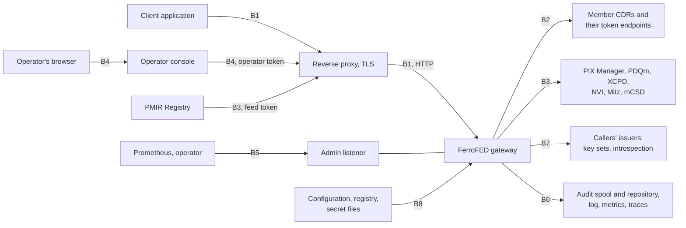

<!-- SPDX-FileCopyrightText: Cadasto B.V. -->
<!-- SPDX-License-Identifier: BUSL-1.1 -->

# Threat model

This page names what a FerroFED gateway protects, the trust boundaries it
sits on, who can attack each boundary and from where, and what stops them.
Each mitigation names the setting, the check or the test that provides it.
Each risk the gateway does not close is named too, with the issue that
tracks it or the control your deployment has to supply. The
[hardening guide](../operate/hardening.md) turns this page into a checklist.

The method is STRIDE per boundary: spoofing, tampering, repudiation,
information disclosure, denial of service and elevation of privilege. The
specification's own security model is §13: every client is authenticated
(§13.1, N25), the gateway authenticates to every node and tells it who asks
(N24), each node makes its own access and consent decision (§13.2, N26, N27),
and no directly identifying patient identifier reaches a node (§5.4.1, N33).
§13.4 leaves five decisions to each deployment, which
[The §13.4 deployment decisions](../operate/deployment-decisions.md) answers
for the gateway. No specification governs the rest of this page: our own
design.

## Assets

| Asset | Why it matters |
|---|---|
| The patient identifier | it names a person; it may reach the identity services and nothing else |
| Clinical data in transit | the answers a node releases and the writes a client sends |
| The caller's identity and token | the token admits its holder at the gateway; the identity is what each node audits and decides on |
| The onward credentials and the signing key | they make the gateway's requests acceptable to every node; the signing key vouches for every caller |
| Routing state | the resolution bindings, the `ehr_id` index and the `creating_system_id` routes decide which node a follow-up reaches; a wrong route sends a request to another patient's record |
| The audit records | the IHE audit trail and the access records name patients and callers, and are evidence after the fact |
| The configuration and the registry | they decide whom the gateway trusts and where it sends data |
| Availability | one federated query becomes a request to every member, so the gateway's load is every CDR's load |

## Trust boundaries

| Boundary | Between | What crosses it |
|---|---|---|
| B1 | a client and the gateway | the access token, the AQL with the patient identifier, write bodies, answers |
| B2 | the gateway and each member node | the node's `ehr_id`, the onward credential, the signed caller token, write bodies, answers |
| B3 | the gateway and the identity services | the patient identifier, the gateway's credentials, the identities in a PMIR feed message |
| B4 | the operator's browser, the console and the gateway | the operator's sign-in, the operator's token, query answers |
| B5 | a scraper or an operator and the admin listener | metrics; the stored-query distribution |
| B6 | the gateway and its audit and telemetry sinks | audit records that name patients and callers; log lines, metrics and spans that name neither |
| B7 | the gateway and the issuers it trusts | the key sets that decide which tokens are genuine |
| B8 | the host and the gateway | the configuration, the registry document, the credentials and the signing key |

## Attacker positions

| Position | Who |
|---|---|
| P1 | anyone who can reach the gateway's listener without a valid token |
| P2 | an authenticated caller that reaches for more than it was granted: another patient, another operation, the operator surface |
| P3 | someone on the network path of a hop: between the proxy and the gateway, the gateway and a node, the gateway and a service |
| P4 | a member node, or an identity service, that is compromised or misbehaves |
| P5 | an issuer that is compromised, or a party that can substitute an issuer's keys |
| P6 | someone with read access to the logs, metrics or traces |
| P7 | a workload in the same pod network or on the same host as the gateway |
| P8 | a website the operator visits while signed in to the console |
| P9 | an insider with access to the host, the volumes or the secrets |

## B1: client to gateway

| | Threat | From | Mitigation | Provided by |
|---|---|---|---|---|
| S | a request without a valid token, a token signed with `none` or an HMAC key, a token for another audience or from an untrusted issuer | P1 | every request to `{base}/v1/` and `OPTIONS {base}/` is verified before anything else is read: `at+jwt`, ES256, ES384, PS256 or RS256, a trusted `iss`, this gateway's `aud`, `exp` and `nbf` (RFC 9068, RFC 8725 §3.1, §3.2); there is no unauthenticated mode | `[auth]`, `[[auth.issuer]]`; `app/ferrofed-server/tests/it/auth/token.rs` |
| S | a proxy header that claims a caller | P1, P3 | the edge mode takes a signed assertion verified like a token, never a header trusted for where it came from (RFC 7239 §8.1) | `auth.mode = "edge"`, `[auth.edge]`; `app/ferrofed-server/tests/it/auth/edge.rs` |
| E | a caller reads another patient, or an operation its scopes do not cover | P2 | SMART on openEHR scopes per route; `system/aql-*` only for `backend_clients`; a `patient/` grant admits nothing unless its issuer is bound to one member, and then only that patient's `{node, ehr_id}` pairs; purpose of use required | [Scopes per route](../operate/authentication.md#scopes-per-route), [Patient grants](../operate/authentication.md#patient-grants); `app/ferrofed-server/tests/it/auth/scope.rs`, `patient.rs`, `other_patient.rs`, `purpose.rs` |
| S | a client application with no user, or a user authenticated below the level the deployment requires, reading patient data | P1 | a token whose `sub` is its `client_id`, or that only `system/` scopes cover, reaches no patient data unless its issuer declares its client tokens as acting for the professional the token names; an issuer's `[auth.issuer.assurance]` refuses a token below its least level (Regulation (EU) 2025/327 Annex II 3.1; RFC 9470 §3) | [Professionals and assurance](../operate/authentication.md#professionals-and-assurance); `app/ferrofed-server/tests/it/auth/professional.rs` |
| E | the ADMIN API, or the operator surface without the operator scope | P2 | the ADMIN API is refused to every caller; the operator routes need the issuer's `operator_scope` as one whole scope token | `auth.issuer[].operator_scope`; `app/ferrofed-server/tests/it/operator.rs` |
| T | an AQL query that smuggles the patient identifier, a second patient, or text around the subject | P2 | the query is parsed and the node query is printed from the rewritten syntax tree; a subject the rewrite cannot consume exactly is `400` before any dispatch (§5.4.3) | [Where the patient identifier stops](../how-it-works/identifier-hygiene.md); `app/ferrofed-server/tests/it/hygiene.rs` |
| T | an undeclared header or query parameter, or a declared value of the wrong kind, forwarded to a node | P2 | a routed request carries only what its ITS-REST operation declares; `Accept`, `Content-Type` and `Prefer` are composed by the gateway; a value of the wrong kind is `400` with nothing sent | [Declared values](../operate/configuration.md#declared-values); `app/ferrofed-server/tests/it/declared.rs` |
| R | a caller denies a request | P2 | the gateway records each query, read and write that reached a node with the verified caller and its request id, before the answer leaves; the request id travels to every node with the signed caller token, and each node audits who asked (N24) | [The access log](../operate/audit.md#the-access-log), [Verifying it at the node](../operate/authentication.md#verifying-it-at-the-node); `app/ferrofed-server/tests/it/access/`, `conveyance.rs` |
| I | the patient identifier in a response, an error or a refusal | P1, P2 | errors name the position of the offending part, never the value; a node's error quoted in `meta.federation` has each consumed value masked | `app/ferrofed-server/tests/it/errors.rs`, `facade/query.rs`; `app/ferrofed-engine/tests/it/dispatch.rs` |
| D | a flood of requests, a large body, a slow request | P1, P2 | a concurrency limit refused before the caller is verified; a per-caller rate; a body limit (`413`) and a request timeout (`408`) | `server.max_concurrent_requests`, `[server.caller_rate]`, `server.body_limit_bytes`, `server.request_timeout_ms`; `app/ferrofed-server/tests/it/overload.rs` |
| I | the token or the patient identifier read on the hop between the proxy and the gateway | P3 | the listener speaks plain HTTP by default: keep that hop inside one host or pod, protect it with a mesh, or set `[server.tls]` with a `client_ca_file` that admits the proxy alone | [TLS on the listeners](../operate/configuration.md#tls-on-the-listeners); `app/ferrofed-server/tests/it/listener_tls/` |

The health family, `GET {base}/` and `GET {base}/.well-known/jwks.json` are
open by design, and none of them names a member. `GET {base}/` names the
product version; restrict it at the proxy if your network should not learn
it. The dependency report, which names every member endpoint id and its last
observed state, is served only to an operator, at
`GET {base}/operator/dependencies` behind the operator scope.

## B2: gateway to member node

| | Threat | From | Mitigation | Provided by |
|---|---|---|---|---|
| I | the patient identifier reaches a node in the query, the path, the query string, a header or the caller claims | P4 | the rewrite strips or refuses the subject; the outbound gate re-reads every finished request, the caller claims included, and stops one that carries a consumed value (§5.4.1, N33, CP-2, CP-26, CP-38) | `app/ferrofed-engine/tests/it/gate.rs`; the adversarial track 10, `app/ferrofed-server/tests/it/track10/` |
| S | a node replays the caller's token at another node | P4 | the caller's token is never forwarded; each node gets its own onward credential and a caller token signed for its endpoint id alone, valid 60 seconds | [What a node is told about the caller](../operate/authentication.md#what-a-node-is-told-about-the-caller); `app/ferrofed-server/tests/it/auth/token.rs` |
| S | someone obtains an onward token and replays it at its node | P3, P4 | onward tokens can be bound to the gateway's key with DPoP, or the connection to a client certificate with RFC 8705 | `[credentials."<id>"] … dpop_key_file`, `client_identity_file`; `app/ferrofed-engine/tests/it/dpop/`, `mtls.rs` |
| I | a credential sent to a node in cleartext | P3 | outside the development profile, a node URL that receives a credential must be `https`, refused at start and on reload | [What must travel encrypted](../operate/configuration.md#what-must-travel-encrypted); `app/ferrofed-server/tests/it/transport/` |
| T | two nodes claim one `ehr_id`, or a node claims another's `creating_system_id` | P4 | a follow-up on a collided `ehr_id` is `409` and an integrity incident; a conflicting learned route is withdrawn (§12.5.2, §12b.2, N21, N42) | `app/ferrofed-server/tests/it/ehr_id_collision.rs`; `FerroFEDIntegrityIncident` |
| E | a node releases more than the caller may see | P4 | each node gets the caller's scopes and purposes of use and decides what to release (§13.2, N26, N27) | the node's own enforcement |
| D | a slow or failing node holds the gateway | P4 | per-node and overall budgets; at most `max_in_flight_per_node` requests to one member at once; a silent member is named in the answer and fails it under the all-or-nothing default (§11) | `federation.per_node_timeout_ms`, `overall_timeout_ms`, `max_in_flight_per_node`; `app/ferrofed-server/tests/it/timeouts.rs`, `overload.rs` |
| D | a node answers without end, or with a body too large to hold, so the gateway buffers it on every request | P4 | the gateway reads at most `max_node_answer_bytes` of one answer from a node or its token endpoint and drops the rest unread; the member is `node-error`, named in the answer, and fails it `424` under the all-or-nothing default (§11.1, §11.4) | `federation.max_node_answer_bytes`; `app/ferrofed-server/tests/it/overload.rs`, `app/ferrofed-server/src/node_transport.rs` |

## B3: gateway to the identity services

| | Threat | From | Mitigation | Provided by |
|---|---|---|---|---|
| I | the patient identifier read in transit | P3 | the URL of every PIX Manager, PDQm Supplier, XCPD gateway and NVI must be `https` outside development; optional mutual TLS | [What must travel encrypted](../operate/configuration.md#what-must-travel-encrypted), [Mutual TLS to the identity services](../operate/configuration.md#mutual-tls-to-the-identity-services) |
| T | a wrong or forged cross-reference routes a query to another patient's EHR | P4 | none in the gateway beyond the transport: the identity service is trusted for its links | **carried by the deployment:** the service's own controls; record the trust in your [§13.4 decisions](../operate/deployment-decisions.md#5-what-the-technique-does-not-cover) |
| S | a forged ITI-93 message drops bindings | P1 | the feed route takes only the bearer token agreed with the Registry; a message without it is `401` and changes nothing | `pmir.feed_token_file`; `app/ferrofed-server/tests/it/pmir/feed.rs` |
| T | a stale binding after a merge at the identity source | P4 | each binding lives `binding_ttl_ms` after the last resolution that returned it; `[pmir]` drops the stale ones as the change arrives, on the replica that receives it | `federation.binding_ttl_ms`, `[pmir]` |
| D | an identity service that does not answer | P4 | budgets per exchange; a resolution that fails is never a pass: under the all-or-nothing default the query fails `424` | `[pixm]`, `[pdqm] timeout_ms`, `[federation.localization] on_failure` |
| R | a transaction with no audit record | P9 | every record is on disk before the transaction's answer is used; a record that cannot be stored fails the transaction closed | [The spool and the failure policy](../operate/audit.md#the-spool-and-the-failure-policy); `app/ferrofed-server/tests/it/feed_audit/`, `audit_repository.rs` |

## B4: the operator console

| | Threat | From | Mitigation | Provided by |
|---|---|---|---|---|
| S | a forged sign-in, a replayed ID Token | P8 | authorization code with PKCE and a `nonce`; the ID Token verified against the provider's key set, issuer, audience and expiry | [The operator console](../operate/operator-console.md); `app/ferrofed-viewer/tests/it/sign_in.rs` |
| T | another site signs the operator out or spends the sign-in on a query | P8 | every unsafe request must be same-origin by fetch metadata, `Origin` or `Referer`; `SameSite=Lax`; server functions are `POST` only | `app/ferrofed-viewer/tests/it/sign_out.rs`, `query_safety.rs` |
| I | a node's value runs as script in the console, or the page is framed | P4, P8 | every value is escaped on the server; a nonce CSP with `frame-ancestors 'none'`, `X-Frame-Options: DENY`, `nosniff`, `no-referrer` | `app/ferrofed-viewer/tests/it/server.rs`, `query_safety.rs` |
| I | the operator's token or an answer kept by the browser | P8, P9 | the token stays on the console's server; every page is `no-store`; pages are never compressed | `[session] secure_cookie`; `app/ferrofed-viewer/tests/it/query_safety.rs` |
| D | a flood of `GET /login` | P1 | pending sign-ins and sessions are separate, bounded pools | `max_sign_ins`, `max_sessions`; **carried by the deployment:** a rate limit for `/login` at the edge |

The console sends no `Strict-Transport-Security`; set it at the proxy in
front of it.

## B5: the admin listener

| | Threat | From | Mitigation | Provided by |
|---|---|---|---|---|
| E | a remote peer runs a write action, such as the stored-query distribution | P7 | every write action needs a token that client authentication verifies and that carries its issuer's `operator_scope`; the listener is off unless `[metrics] listen` is set, on loopback unless `allow_remote = true`, and never under the base path | `[metrics]`, `auth.issuer[].operator_scope`; `app/ferrofed-server/tests/it/admin_peer.rs` |
| S | a local process on the host or in the pod runs a write action | P7, P9 | the same token is needed from a loopback peer; only `profile = "development"` admits a loopback peer without one | `profile`; `app/ferrofed-server/tests/it/admin_peer.rs` |
| R | an operator denies running a write action | P7 | each admitted write action is logged under `ferrofed::security` before it has any effect (`admin-write-admitted`, counted) and when it ends with its outcome (`admin-write-finished`, `abandoned` when it never answered), with the operator's issuer and subject, the action and the time; no log filter quiets the target | `app/ferrofed-server/tests/it/admin_record.rs`, `stored_redistribution.rs`; **carried by the deployment:** keeping the security log |
| I | anyone who reaches the port reads the metrics | P7 | no label carries a request value; off loopback the gateway refuses to start outside development unless a scrape token or a client CA authenticates the scrape; the Kubernetes example opens the port to Prometheus alone | `[metrics] scrape_token_file`, `[metrics.tls] client_ca_file`; `app/ferrofed-server/tests/it/metrics/hygiene.rs`, `config/admin.rs`; `deploy/kubernetes/networkpolicy.yaml` |

## B6: audit and telemetry sinks

| | Threat | From | Mitigation | Provided by |
|---|---|---|---|---|
| I | a patient identifier or a caller in a log line, a metric or a span | P6 | the request log carries no body, AQL text, header value or path; labels come from closed sets; spans carry route templates, ids and counts; the trace id is the gateway's own | `app/ferrofed-server/tests/it/request_log.rs`, `metrics/hygiene.rs`, `traces/`; `track10` asserts the logs clean |
| I | the audit spool read on disk | P9 | the spool is `0700` with files `0600`, and the gateway refuses to start when it is open to other users | `app/ferrofed-server/tests/it/audit_repository.rs`; **carried by the deployment:** an encrypted volume |
| T, R | audit records lost with a spool | P9 | records are delivered in order from disk; a lost spool loses them for good, and `audit_feed` or `audit_repository` reads `degraded` while records wait | [Losing a spool](../operate/container.md#losing-a-spool); **carried by the deployment:** durable storage per replica |
| I | metrics or spans pushed in cleartext | P3 | OTLP is plain gRPC: run the collector beside the gateway; a credential in the URL is refused outside development | **open:** [#644](https://github.com/FerroHEALTH/FerroFED/issues/644) |
| R | no record of which caller read which EHR | P2 | every federated query, stored-query execution, routed read and routed write that reached a node is recorded with the verified caller, the patient, each `ehr_id` and each endpoint asked; the record is stored before the answer leaves, and an access whose record cannot be stored is `503 access-unrecorded` with none of the data; outside development a gateway with a registry refuses every `[audit] destination` but `repository`; the node audits the conveyed caller too (N24) | [The access log](../operate/audit.md#the-access-log); `[audit]`, `[access_log]`; `app/ferrofed-server/tests/it/access/`, `feed_audit/config.rs` |

## B7: the callers' issuers

| | Threat | From | Mitigation | Provided by |
|---|---|---|---|---|
| S | a key set fetched in the clear and substituted | P3 | every `jwks_uri` and `introspection_endpoint` is `https`, or `http` to loopback, under every profile | [What must travel encrypted](../operate/configuration.md#what-must-travel-encrypted) |
| D | tokens naming unknown keys make the gateway flood the issuer | P1 | an unknown `kid` refetches at most once per `key_set_refetch_s`; an unavailable key set is `503`, never a pass | `auth.key_set_refetch_s`; `app/ferrofed-server/tests/it/auth/keys.rs` |
| S, E | an issuer compromised: any token it signs is admitted | P5 | none in the gateway: a trusted issuer is trusted for every caller it vouches for | **carried by the deployment:** a short trust list, per-issuer `backend_clients`, `demographic_clients` and `operator_scope`, and removing an issuer at once; reloading `[auth]` without a restart is [#636](https://github.com/FerroHEALTH/FerroFED/issues/636) |

## B8: configuration and secrets

| | Threat | From | Mitigation | Provided by |
|---|---|---|---|---|
| I | a secret in a log, an error, the banner or a `Debug` print | P6 | secrets come from `_file` keys, are redacted in `Debug` and zeroised after reading; a refused configuration names the key, never the value | [Configuration](../operate/configuration.md); `app/ferrofed-server/tests/it/config/redaction.rs`, `config/secrets.rs`, `credentials.rs`, `banner.rs` |
| T | a configuration that weakens transport or resolves from a static table | P9 | the development profile alone admits `[dev]` and cleartext credentials, takes a restart to change, and prints a red notice; `config check` exits `78` on a refused file | `profile`; `app/ferrofed-server/tests/it/transport/` |
| S | the signing key leaks | P9 | the key is a file; rotation publishes the next key ahead of signing with it | `[signing] next_key_file`, `previous_key_file`; `app/ferrofed-server/tests/it/next_key.rs` |

## Risks the deployment carries

The gateway cannot close these on its own. Each needs a decision or a
control from you, or an issue that is open:

1. **The proxy-to-gateway hop is cleartext unless you set `[server.tls]`.**
   Bearer tokens and patient identifiers cross it. Keep it on one host or in
   one pod, put a mesh with mutual TLS on it, or serve TLS on the listener
   with a client CA that admits the proxy alone
   ([TLS on the listeners](../operate/configuration.md#tls-on-the-listeners)).
2. **The development profile opens the admin listener's write actions on
   loopback.** Under `profile = "development"` any process that reaches the
   listener's loopback address runs a write action without a credential.
   Never serve real requests in that profile
   ([Metrics](../operate/metrics.md#who-the-admin-listener-serves)).
3. **The access records live at your Audit Record Repository.** The
   gateway stores each record in the spool before it answers, and refuses
   an access it cannot record, but who may read the records and how long
   they are kept is the repository's. FerroFED's own review interface and
   retention by origin and category are planned
   ([#521](https://github.com/FerroHEALTH/FerroFED/issues/521)).
4. **Bearer replay.** An onward token or a caller token stolen at a node can
   be replayed at that node until it expires (§13.4). DPoP or mutual TLS
   narrows it for onward tokens; the caller token lives 60 seconds.
5. **A compromised issuer** is admitted for every caller it vouches for,
   and changing `[auth]` takes a restart
   ([#636](https://github.com/FerroHEALTH/FerroFED/issues/636)).
6. **A node that ignores the conveyed caller** releases what its own
   credential allows. Admission is where you check that each node verifies
   the token ([Admitting a node](../operate/admission.md)).
7. **The identity service is trusted for its links.** A wrong link routes a
   query, or a bound patient grant, to another patient's EHR.
8. **Per-replica routing state.** A PMIR change reaches one replica, and the
   others route on a stale binding for up to `binding_ttl_ms`
   ([Several replicas](../operate/identity.md#several-replicas)).
9. **The audit spool** names patients; its encryption at rest and its
   survival are the volume's.
10. **The console's session** ends when the operator's access token
    expires, and a refresh is
    [#643](https://github.com/FerroHEALTH/FerroFED/issues/643); its
    sign-in has no per-client rate limit of its own.
11. **Telemetry export** is plain gRPC to the collector
    ([#644](https://github.com/FerroHEALTH/FerroFED/issues/644)).
12. **Egress.** The Kubernetes example leaves egress open so the gateway
    reaches its members and services wherever they are; restricting it is
    yours ([#638](https://github.com/FerroHEALTH/FerroFED/issues/638) covers
    the packaging).
