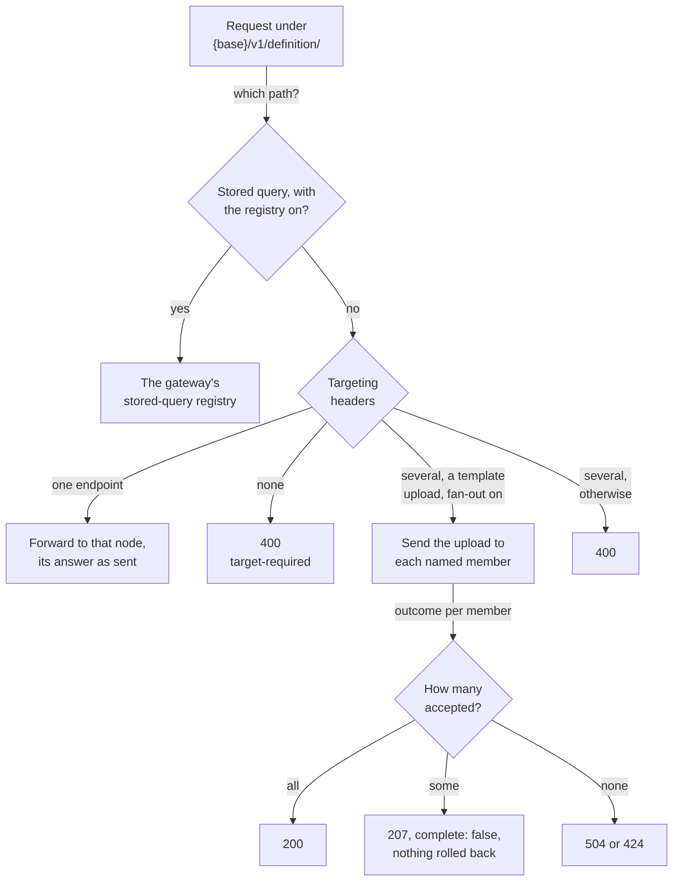
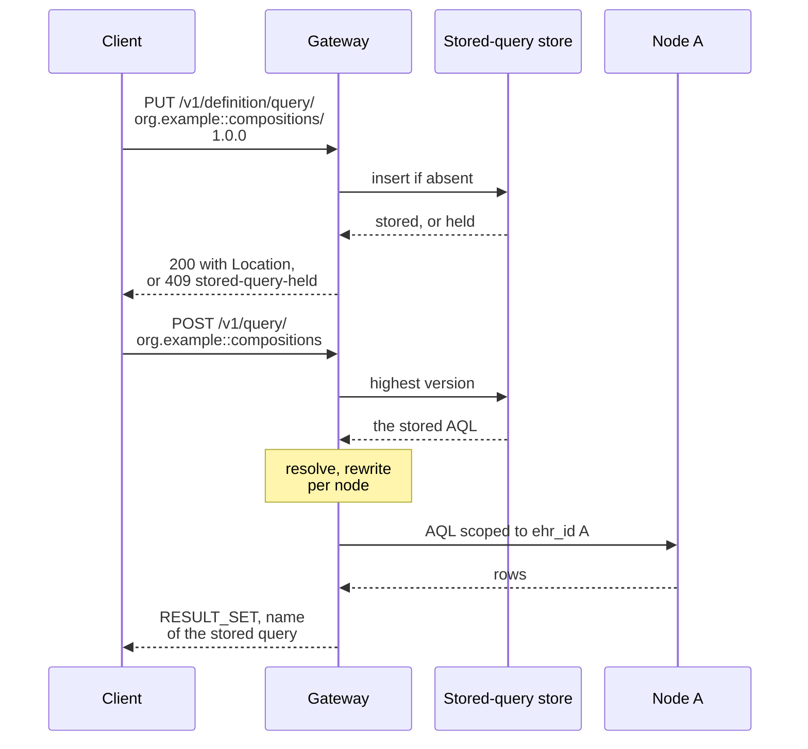
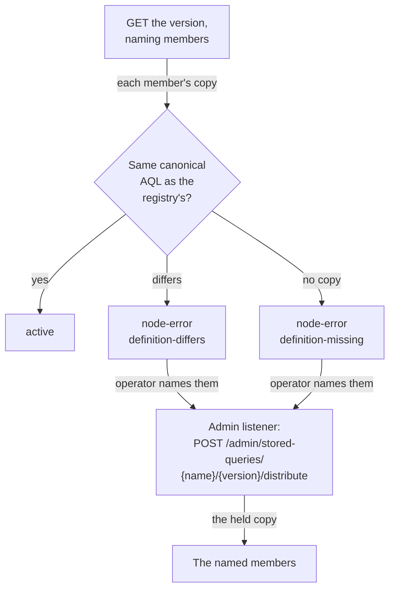

<!-- SPDX-FileCopyrightText: Cadasto B.V. -->
<!-- SPDX-License-Identifier: BUSL-1.1 -->

# Definitions and stored queries

A template lives at the node it was uploaded to, and a `COMPOSITION` built on
it validates only there. A gateway that hid that from you would let you
upload a template at one node and commit against it at another (§12.6). So
the definition area goes to one node you name, with two opt-in exceptions
your deployment declares in `OPTIONS {base}/`: a template upload fanned out
to several members, and a stored-query registry the gateway holds itself
(§12.6, §12.7, N43, N44).

## Where a definition request goes

The diagram shows §12.6 with N43 and CP-34.

- The gateway never picks a node for you and never merges two nodes'
  template lists into one catalogue (§12.6, N43).
- Fan-out template upload is off by default and declared as
  `definition.fan_out_template_upload` (§7a.2). A member that accepts keeps
  the template whatever the others answer, and a partial success is never
  reported as success (§12.6 `template-fanout`).
- The fan-out answer carries `meta.federation` with one entry per member, in
  the shape of a federated query's (§9.5).

## The stored-query registry

With `[stored_queries]` set, the gateway is authoritative for each stored
query (§12.7, N44, CP-40). A version is immutable: a second `PUT` of a held
name and version is refused, before and after a restart. You invoke a
stored query by name, and the gateway runs its AQL over the members exactly
as an inline query.

- A definition names its patient through a `$parameter`. A literal patient
  identifier is refused, because the store would hold it at rest (§5.4.1,
  N33).
- The store is `redb` for one gateway, PostgreSQL for several replicas, or
  read-only files your operator publishes ([Queries and API
  areas](../operate/queries-and-areas.md#stored-queries)). Reads go through
  an in-memory cache of immutable versions, so no query waits on the store
  while it talks to nodes.

## Distribution, drift and the repair

With `federation.fan_out_stored_queries` set beside the registry, a `PUT`
that names members in the targeting headers is stored first and then sent to
each named member, on the template fan-out's four terms (§12.7
`stored-query-fanout`). A member's copy can drift later: a failed
distribution, a local `PUT` at the node, a restore, or a member admitted
after the distribution (§12.7 `stored-query-drift`). An invocation always
runs the registry's copy, so drift never changes an answer. The drift check
and the repair show it to you and fix it.

The repair runs on the admin listener only, because the specification gives
drift repair no request and a second `PUT` of a held version is always
refused (§12.7, N44). No specification governs the repair action: our own
design. A definition that carries a `FROM ENDPOINT` directive is never
distributed, because a node cannot run a directive that names other members
(§12.7 `fanout-endpoint-targeted-refused`).

The [stored queries](../integrate/stored-queries.md) and
[templates](../integrate/templates-and-demographics.md) pages give every
request and code.
