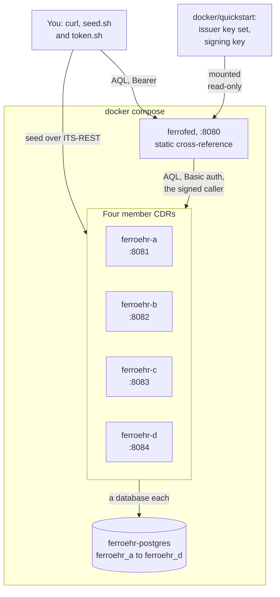
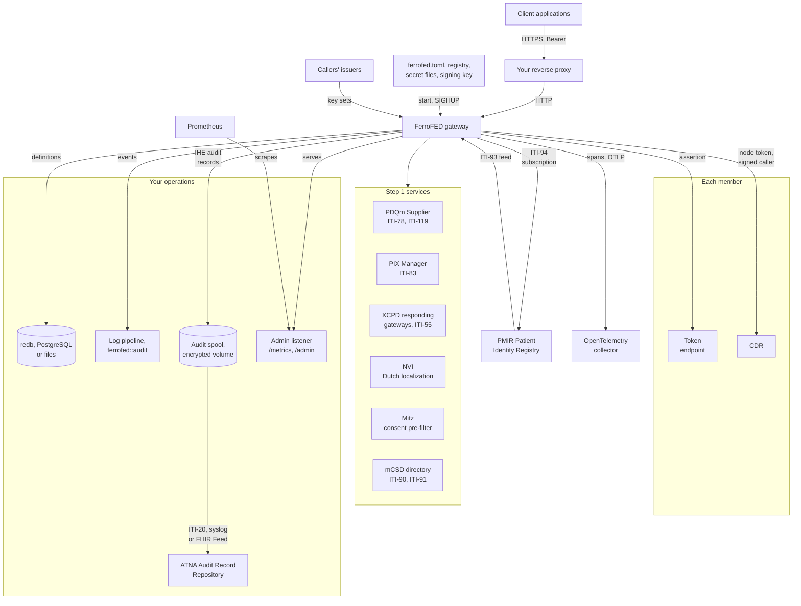
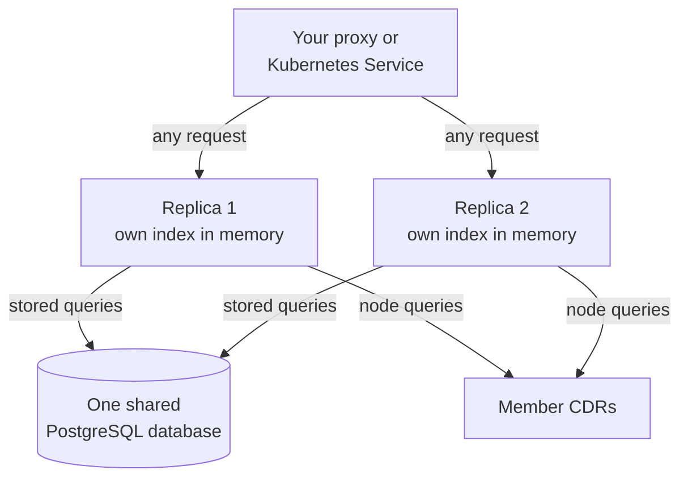

<!-- SPDX-FileCopyrightText: Cadasto B.V. -->
<!-- SPDX-License-Identifier: BUSL-1.1 -->

# Deployment

The gateway is one static binary in one container image. What it needs
around it is the roles of §4.1: member CDRs over ITS-REST, an identifier
cross-reference, and the registry that addresses each member (§15, N21).
This page draws the two shapes the book describes: the quickstart you run on
one machine, and a production layout. No specification governs the process
model or the topology: our own design.

## The quickstart

The repository's `compose.yaml` runs the gateway beside four member CDRs, four
FerroEHR instances, on one PostgreSQL server that holds a database per node
([The quickstart](../operate/container.md#the-quickstart)). The gateway runs
in the development profile, with a static cross-reference from four synthetic
patients to their EHRs in place of a PIX Manager. It trusts one development
issuer, whose tokens `scripts/quickstart/token.sh` prints, and signs with a
key `scripts/quickstart/signing-key.sh` writes once
([The quickstart issuer](../operate/authentication.md#the-quickstart-issuer)).

- Every port binds the loopback interface, so nothing is reachable from the
  network until you name an interface.
- The seed script writes over each node's ITS-REST API only, with
  identifiers in the example arc `urn:oid:2.999`.
- The node credentials and database passwords are development values that
  must not reach anything real.

## A production layout

In production the gateway sits behind your reverse proxy, from the release's
`compose.yaml` or the Kubernetes example ([The gateway from a
release](../operate/container.md#the-gateway-from-a-release),
[Kubernetes](../operate/container.md#kubernetes)). It resolves patients
through your PIX Manager and, when you configure them, asks a PDQm Supplier
first, localizes through XCPD or the Dutch NVI, and pre-filters on consent
through Mitz.

- **The proxy** terminates TLS. The gateway authenticates each caller
  itself, against the key sets of the callers' issuers, or verifies the
  assertion of a proxy in the explicit edge mode
  ([Client authentication](../operate/authentication.md)).
- **The configuration** is your reviewed files. The registry reloads on
  `SIGHUP` with no restart, and every credential and the signing key is a
  file named by a `_file` key ([Configuration](../operate/configuration.md)).
- **The Step 1 services.** The PIX Manager resolves each patient to an
  `ehr_id` per member, and without `[xcpd]` or `[nl_gf.nvi]` it is the
  localizer too. The XCPD responding gateways localize when you configure
  `[xcpd]`, and the NVI when you configure `[nl_gf.nvi]`. A PDQm Supplier,
  under `[pdqm]`, names the master identity of a patient the cross-reference
  does not know by the client's identifier, and Mitz, under `[nl_gf.mitz]`,
  is the consent pre-filter
  ([Identity resolution](../operate/identity.md)). The mCSD directory, when
  you read the registry from one instead of a document, is asked with ITI-90
  at start and with ITI-91 every refresh interval, off the clinical path
  ([The registry](../operate/registry.md#the-registry-read-from-an-mcsd-directory)).
- **Each member's token endpoint**, where its `oauth2` section names one,
  issues the gateway an access token for a client assertion the signing key
  signs, and checks that assertion against `{base}/.well-known/jwks.json`.
  Under token exchange the token is issued per verified caller, and with a
  DPoP key it is bound to the gateway's key. A `nuts` or `fapi2` section
  obtains the token on a track of the Dutch binding instead. A member
  without one is sent its static credential, if it has one
  ([Trust and keys](trust-and-keys.md),
  [Onward credentials](../operate/onward-credentials.md)).
- **The audit of each IHE transaction** goes to your ATNA Audit Record
  Repository: written to a spool on disk first, then sent with ITI-20, so a
  repository outage delays the audit and fails no query. An XCPD exchange,
  under `[xcpd] audit = "repository"`, is a DICOM audit message over syslog
  on TLS; the PIXm, PDQm, mCSD and PMIR transactions, under `[audit]`, are
  FHIR `AuditEvent`s sent with the FHIR Feed. The spool holds audit records
  that name patients, so it belongs on an encrypted volume
  ([The audit trail](../operate/audit.md)). Under `[xcpd] audit = "log"`
  or `[audit] destination = "log"` the records go to the log target
  `ferrofed::audit` instead.
- **The PMIR Patient Identity Registry**, under `[pmir]`, takes the
  gateway's ITI-94 subscription and sends each identity change to the
  gateway's feed route, which drops the resolution bindings the change could
  have made stale
  ([The identity feed](../operate/identity.md#the-identity-feed-pmir)).
- **The admin listener** is a second listener for your operators, off unless
  `[metrics] listen` is set and on loopback unless you allow otherwise
  ([Metrics](../operate/metrics.md)).
- **The OpenTelemetry collector**, when `[telemetry] otlp_endpoint` names
  one, receives the gateway's spans over OTLP
  ([Tracing](../operate/tracing.md)).

## Several replicas

Replicas share nothing in memory: each holds its own resolution bindings,
`ehr_id` index and learned routes, and a miss costs a probe or an explicit
target, never a wrong route. A follow-up write is never probed for, so a
write that names no node is routed only by the replica that resolved the
patient and refused `400` `target-required` by the others: clients name the
node on every write, or the balancer keeps each client on one replica
([Running several replicas](../operate/deployment-shape.md#running-several-replicas)).
The stored-query registry is the one state they must share,
because a stored version must be the same on every replica and a second
`PUT` refused on every replica (§12.7, N44).

A `redb` file opens in one process at a time, so replicas that store queries
use the `postgres` backend, or the read-only `files` backend when your
operator publishes the definitions
([Running several replicas](../operate/deployment-shape.md#running-several-replicas)).
The Kubernetes example runs two replicas under a PodDisruptionBudget.

Replicas behind one address share the PMIR subscription that names it, and
a draining replica leaves it for the others
([Several replicas](../operate/identity.md#several-replicas)). A new signing
key is published by every replica before any replica signs with it
([Rotating the signing key](../operate/onward-credentials.md#rotating-the-signing-key)).
