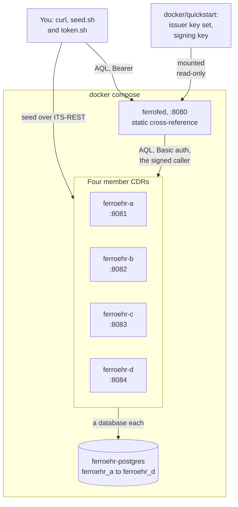
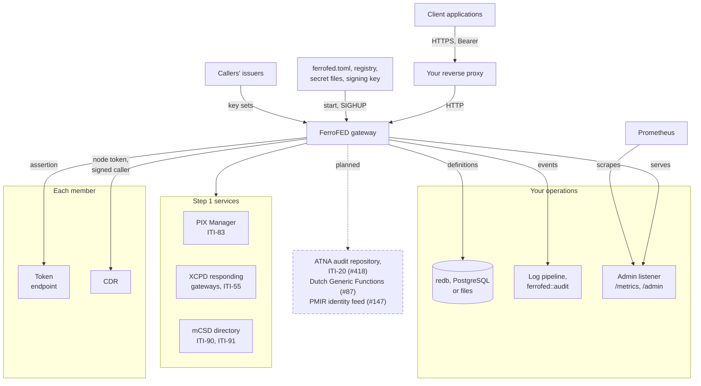
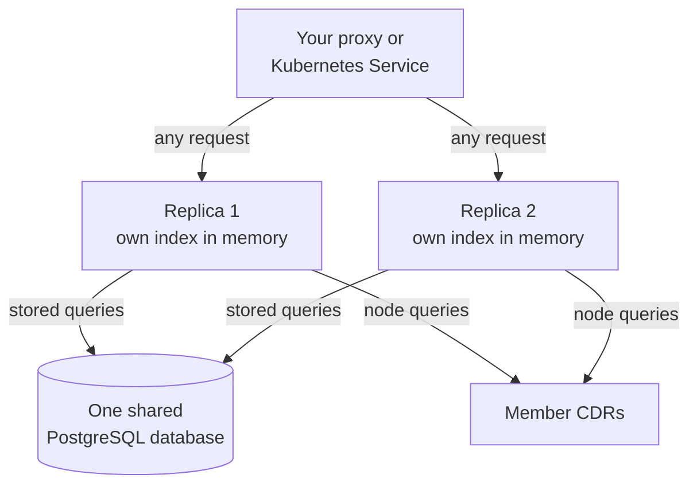

<!-- SPDX-FileCopyrightText: Vernum Projecten B.V. -->
<!-- SPDX-License-Identifier: BUSL-1.1 -->

# Deployment

The gateway is one static binary in one container image. What it needs
around it is the roles of §4.1: member CDRs over ITS-REST, an identifier
cross-reference, and the registry that addresses each member (§15, N21).
This page draws the two shapes the book describes: the quickstart you run on
one machine, and a production layout. No specification governs the process
model or the topology: our own design.

## The quickstart

The repository's `compose.yaml` runs the gateway beside four member CDRs, four
FerroEHR instances, on one PostgreSQL server that holds a database per node
([The quickstart](../operate/container.md#the-quickstart)). The gateway runs
in the development profile, with a static cross-reference from four synthetic
patients to their EHRs in place of a PIX Manager. It trusts one development
issuer, whose tokens `scripts/quickstart/token.sh` prints, and signs with a
key `scripts/quickstart/signing-key.sh` writes once
([The quickstart issuer](../operate/authentication.md#the-quickstart-issuer)).

- Every port binds the loopback interface, so nothing is reachable from the
  network until you name an interface.
- The seed script writes over each node's ITS-REST API only, with
  identifiers in the example arc `urn:oid:2.999`.
- The node credentials and database passwords are development values that
  must not reach anything real.

## A production layout

In production the gateway sits behind your reverse proxy, from the release's
`compose.yaml` or the Kubernetes example ([The gateway from a
release](../operate/container.md#the-gateway-from-a-release),
[Kubernetes](../operate/container.md#kubernetes)). It resolves patients
through your PIX Manager and, when you configure it, localizes them through
XCPD. A dashed box is planned for v0.0.8, with its issue.

- **The proxy** terminates TLS. The gateway authenticates each caller
  itself, against the key sets of the callers' issuers, or verifies the
  assertion of a proxy in the explicit edge mode
  ([Client authentication](../operate/authentication.md)).
- **The configuration** is your reviewed files. The registry reloads on
  `SIGHUP` with no restart, and every credential and the signing key is a
  file named by a `_file` key ([Configuration](../operate/configuration.md)).
- **The Step 1 services.** The PIX Manager resolves each patient to an
  `ehr_id` per member, and without `[xcpd]` it is the localizer too. The XCPD
  responding gateways localize when you configure `[xcpd]`
  ([Identity resolution](../operate/identity.md)). The mCSD directory, when
  you read the registry from one instead of a document, is asked with ITI-90
  at start and with ITI-91 every refresh interval, off the clinical path
  ([The registry](../operate/registry.md#the-registry-read-from-an-mcsd-directory)).
- **Each member's token endpoint**, where its `oauth2` section names one,
  issues the gateway an access token for a client assertion the signing key
  signs, and checks that assertion against `{base}/.well-known/jwks.json`.
  A member without one is sent its static credential, if it has one
  ([Trust and keys](trust-and-keys.md)).
- **The audit of each XCPD exchange** goes to the log target
  `ferrofed::audit` under `[xcpd] audit = "log"`; route that target to your
  audit repository.
- **The admin listener** is a second listener for your operators, off unless
  `[metrics] listen` is set and on loopback unless you allow otherwise
  ([Metrics](../operate/metrics.md)).
- **The planned services** are the audit sent straight to an ATNA Audit
  Record Repository with ITI-20
  ([#418](https://github.com/FerroHEALTH/FerroFED/issues/418)), the Dutch
  Generic Functions, NVI localization, the Mitz consent pre-filter and LRZa
  addressing
  ([#87](https://github.com/FerroHEALTH/FerroFED/issues/87)), and PMIR
  identity-lifecycle notifications from a Patient Identity Source
  ([#147](https://github.com/FerroHEALTH/FerroFED/issues/147)). The
  localization, pre-filter and directory seams they plug into are built.

## Several replicas

Replicas share nothing in memory: each holds its own `ehr_id` index and
learned routes, and a miss costs a probe or an explicit target, never a
wrong route. The stored-query registry is the one state they must share,
because a stored version must be the same on every replica and a second
`PUT` refused on every replica (§12.7, N44).

A `redb` file opens in one process at a time, so replicas that store queries
use the `postgres` backend, or the read-only `files` backend when your
operator publishes the definitions
([Running several replicas](../operate/deployment-shape.md#running-several-replicas)).
The Kubernetes example runs two replicas under a PodDisruptionBudget.
