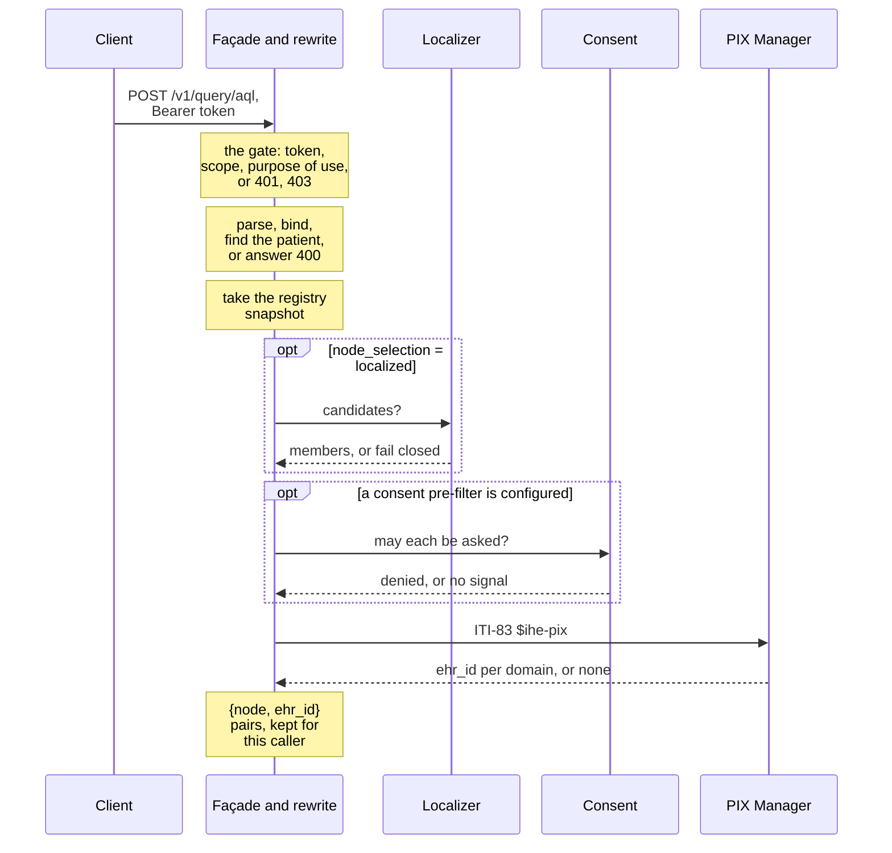
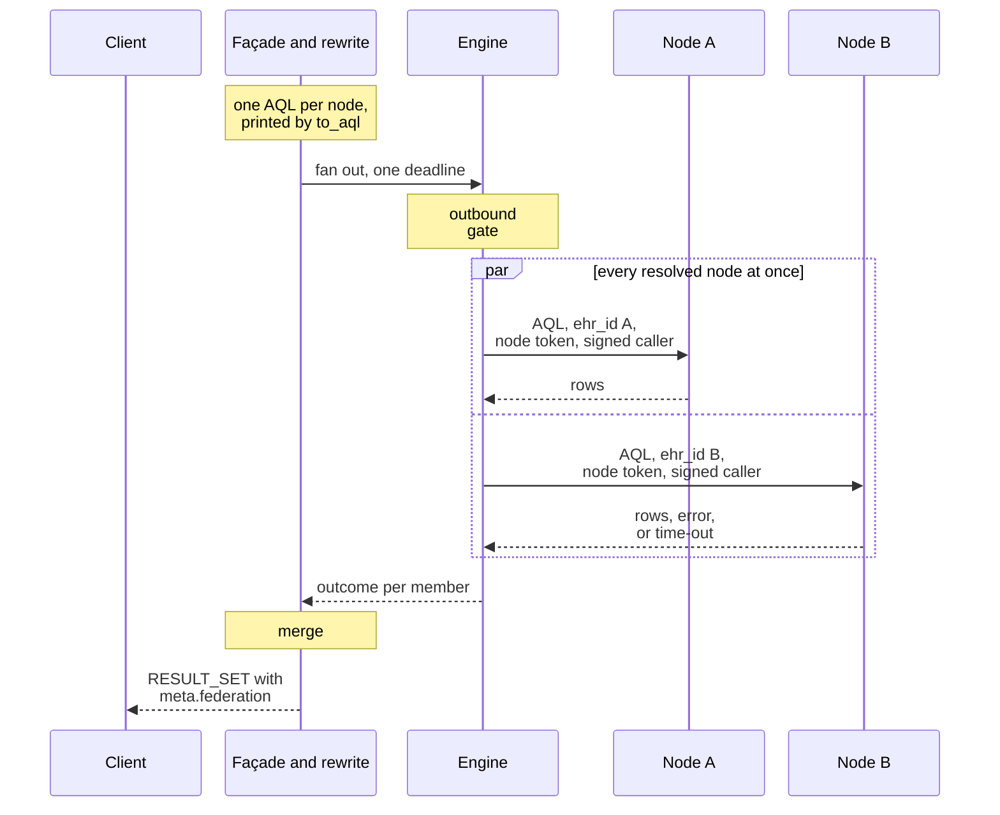
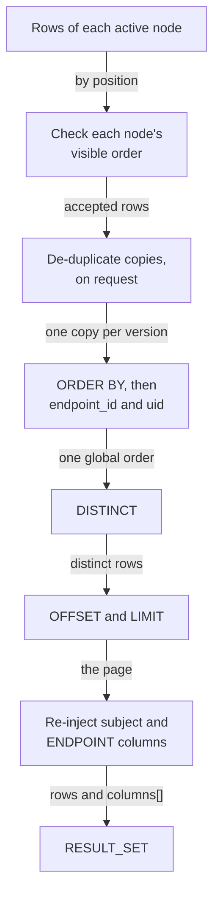
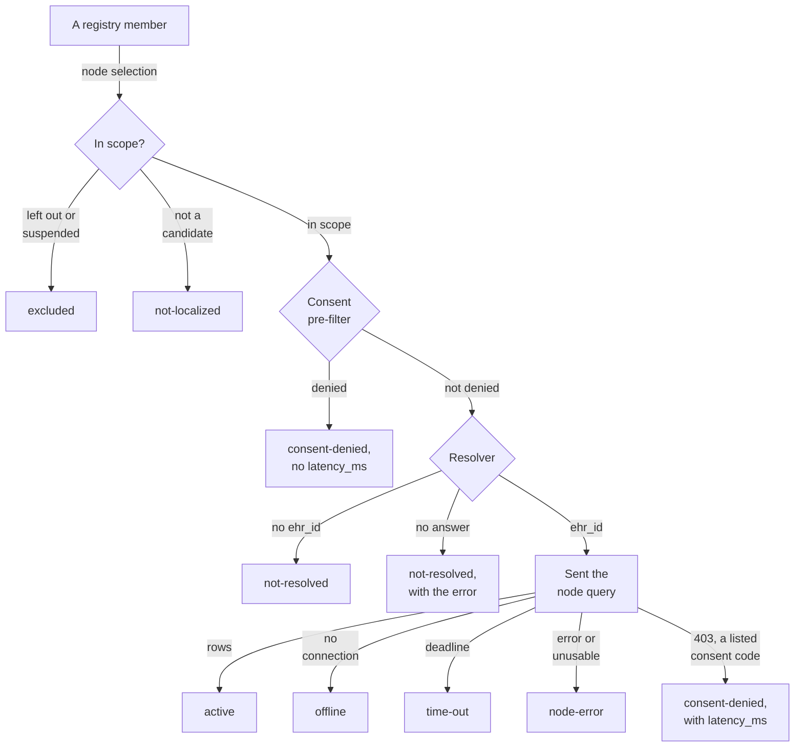
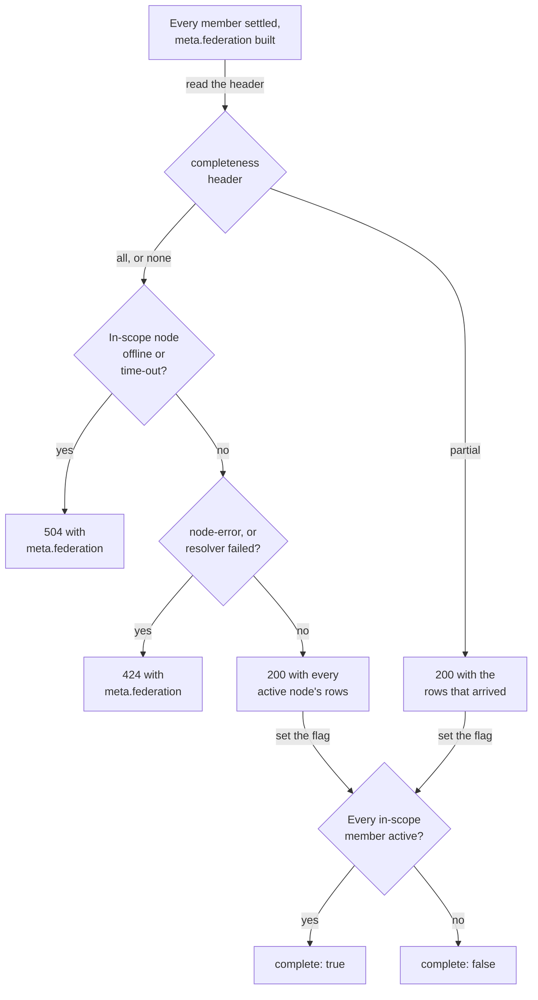

<!-- SPDX-FileCopyrightText: Cadasto B.V. -->
<!-- SPDX-License-Identifier: BUSL-1.1 -->

# A federated query, end to end

You send `POST {base}/v1/query/aql` with a patient query, as you would to one
CDR. This page follows that request through the gateway in two halves:
Step 1 resolves the patient, and Steps 2 and 3 send the node queries and
merge the answers (§4.1). The two closing diagrams show the status each
member gets and the HTTP status of the whole answer. The names match the
[overview](overview.md).

## Step 1: resolve the patient, outside AQL

The client names the patient the openEHR way, for example
`WHERE e/ehr_status/subject/external_ref/id/value = 'ffd-test-0001'` with its
namespace (§7, N2). The gateway takes that value out of the query and asks
the identity seams where the patient is and under which local `ehr_id`
(§5.2, N3, CP-3). The order is fixed: the registry snapshot, then the
localizer, then the consent pre-filter, then the resolver. Only a member the
resolver answers with an `ehr_id`, and the pre-filter did not deny, is sent a
query (N8, CP-36).

- **Node selection** is a declaration you make (§4.3, N4, N10). Under
  `federation.node_selection = "ask-all"`, every active member is a
  candidate. Under `"localized"`, the localizer names the candidates, and a
  member it does not name is `not-localized` and never asked. A directed
  query is never localized (§8).
- **A localizer that fails** fails closed: no member is asked, every member
  is `not-localized` with the localizer's error, and
  `meta.federation.localization.error` carries the same error, so an outage
  never reads as a patient with no data. Only
  `federation.localization.on_failure = "ask-all"` widens instead (§14.1,
  N4, CP-5).
- **The localizer** is one of four
  ([Identity resolution](../operate/identity.md)). IHE XCPD asks every
  responding gateway by the patient identifier alone which communities hold
  the patient (ITI-55, Annex A.3). The NVI of the Dutch binding names the
  care providers that hold data for the patient's pseudonym (Annex B §B.1,
  [Dutch localization](../operate/localization.md#dutch-localization-nl_gfnvi)).
  Without either, the PIX Manager localizes: its candidates are the members
  whose domain holds an identifier for the patient, and the resolution
  reuses that one ITI-83 answer (§14.2). The development cross-reference
  localizes under `profile = "development"`. The read of an EHR by subject
  is localized the same way.
- **The consent pre-filter** is optional and never the gate: a member it
  denies is `consent-denied`, never resolved and never sent a request, and
  every other member is asked so its node can decide (§13.2.1, N27, N27a).
  When the pre-filter cannot answer, every candidate is asked. The
  pre-filter is the development table `[[dev.consent_denied]]` or the Dutch
  binding, Mitz
  ([Dutch consent](../operate/consent.md#dutch-consent-nl_gfmitz)).
- "No identifier in this domain" is an answer: that member is
  `not-resolved` and does not fail the query (N6). A PIX Manager that cannot
  answer is a failure, reported on the member and failing the query `424`
  under the default (§11.4).
- The PIX Manager is the one service that receives the patient identifier,
  because resolving it is its role (§5.2). The gateway never records the
  request URL of that call.

## Steps 2 and 3: dispatch and merge

The rewrite builds one query per resolved node from the parsed AST. The
subject predicate becomes `e/ehr_id/value = '<that node's ehr_id>'`, the
canonical form of N29, and `printer::to_aql` prints it (§7.1, N7, CP-4). The
engine sends every node query at once, under one deadline fixed when the
request arrived (§11.5, N38), and each request passes the outbound gate
first ([Where the patient identifier stops](identifier-hygiene.md)). Each
request carries that node's own credential and the caller's identity in a
token the gateway signs for that node ([Trust and keys](trust-and-keys.md)).

A node that answers after the deadline is ignored, and abandoning one node
never cancels another (§11.5). `meta.federation.timeout` reports the budget
that applied, and each dispatched endpoint reports the `latency_ms` the
gateway saw (N38, N40, CP-31).

## The merge

The gateway reads every node's rows by position against your own `SELECT`,
never against the column names a node sends back. It then shapes them the
way one CDR would (§9 to §11.6). The order of the steps is FerroFED's own
where the specification gives none.

- **`ORDER BY` with `LIMIT n`:** each node is sent `LIMIT n`, and the gateway
  orders the union and cuts it to `n` again (§11.6.1, N39, CP-32). A node
  that returned `n` rows out of the Tier's order is `node-error`, because its
  cut may hide a row.
- **`OFFSET k`:** each node is sent `LIMIT k + n`, up to a window you
  configure, and the gateway slices the merged order (§11.6.2, N39).
- **Aggregates:** `COUNT`, `SUM`, `MIN`, `MAX` and `AVG` over several nodes
  come back as one row, recombined exactly; any other undirected aggregate
  is a `400` (§11.6.3, N14, CP-10).
- **De-duplication:** off by default. `openEHR-federation-dedup:
  version-identity` keeps one copy of a version held at several nodes, the
  one from the CDR that created it, and `meta.federation.dedup` names the
  copies dropped (§10, N15, CP-9).
- **The subject column:** a selected subject is the value you sent, put back
  by the gateway. No node is asked for it (N5, CP-7).

## The status of each member

Every registry member appears in `meta.federation.endpoints[]` exactly once,
with one status from the set of §11.1 (N16, CP-11). The diagram shows how a
member reaches each status.

A member settled before dispatch carries no `latency_ms`, and a member the
gateway sent a request carries the time it observed (N40). That is why the
two `consent-denied` boxes differ. ITS-REST defines no consent signal, so a
node's refusal is `consent-denied` only when it is a `403` whose ITS-REST
`Error` carries a `code` the registry lists for that endpoint in
`consent_refusal_codes`; every other refusal is `node-error`
([Consent](../operate/consent.md)). The list is empty by default,
and the key is FerroFED's own design.

## The status of the whole answer

The default is all-or-nothing: a node that was asked and did not give a
usable answer fails the query, and the failing answer still carries
`meta.federation` (§11.4, N37, CP-30). Best-effort is an opt-in per request
with `openEHR-federation-completeness: partial`.

- `not-resolved` and `consent-denied` are answers. They clear `complete` and
  never fail the query (§11.3, N6). A patient no member holds is a `200`
  with no rows.
- A localizer that failed closed leaves every member `not-localized`, so the
  answer is a `200` with `complete: true` and no rows. Read
  `meta.federation.localization.error` to tell that apart from a patient
  no member holds (§14.1).
- `excluded` and `not-localized` members were never in scope, so they do not
  clear `complete` (§11.1).
- Read `meta.federation.complete`, never the status code: a `200` can carry
  `complete: false` (§11.4).
- A `partial` request for an aggregate the gateway recombines is a `400`,
  because a sum over the nodes that answered is a wrong value.

The [client contract](../integrate/client-contract.md) and
[Errors and status codes](../integrate/errors.md) list every field and code.
