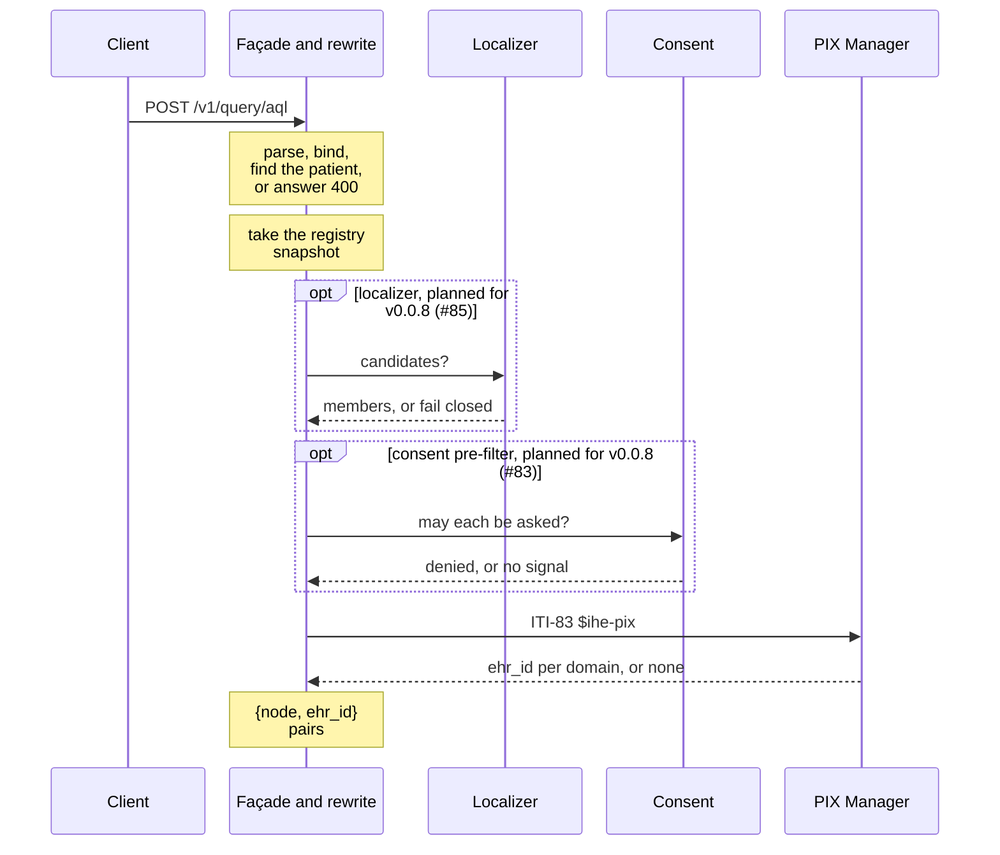
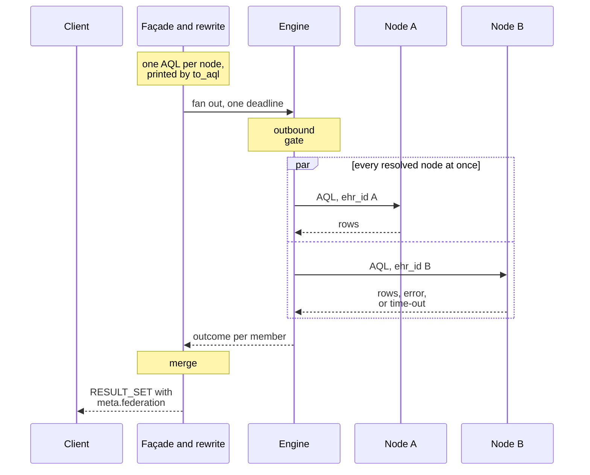
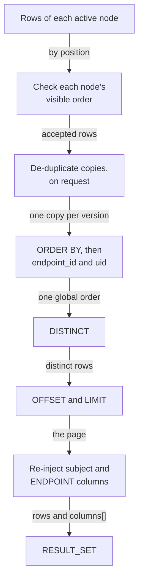
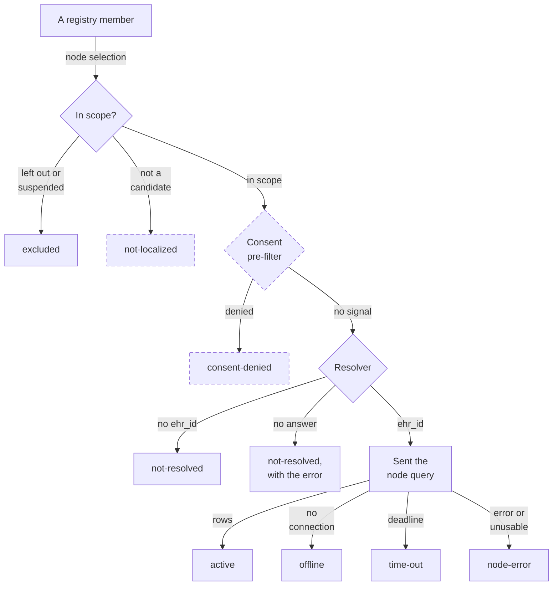
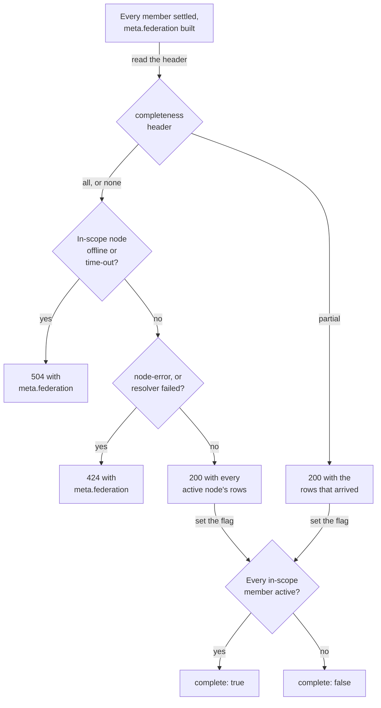

<!-- SPDX-FileCopyrightText: Vernum Projecten B.V. -->
<!-- SPDX-License-Identifier: BUSL-1.1 -->

# A federated query, end to end

You send `POST {base}/v1/query/aql` with a patient query, as you would to one
CDR. This page follows that request through the gateway in two halves:
Step 1 resolves the patient, and Steps 2 and 3 send the node queries and
merge the answers (§4.1). The two closing diagrams show the status each
member gets and the HTTP status of the whole answer. The names match the
[overview](overview.md).

## Step 1: resolve the patient, outside AQL

The client names the patient the openEHR way, for example
`WHERE e/ehr_status/subject/external_ref/id/value = 'ffd-test-0001'` with its
namespace (§7, N2). The gateway takes that value out of the query and asks
the identity seams where the patient is and under which local `ehr_id`
(§5.2, N3, CP-3). The order is fixed: the registry snapshot, then the
localizer, then the consent pre-filter, then the resolver. Only a member the
resolver answers with an `ehr_id` is sent a query (N8, CP-36).

- With no localizer, every registry member is a candidate (§4.3, N4). A
  configured localizer that does not answer leaves no candidate and asks no
  node, unless you declared an ask-all fallback (§14.1, N4, CP-5). The
  localization seam and its XCPD adapter are planned for v0.0.8
  ([#85](https://github.com/FerroHEALTH/FerroFED/issues/85)).
- A consent pre-filter is optional and never the gate: every node still
  checks consent before it releases data (§13.2, N27, N27a). The pre-filter
  is planned for v0.0.8
  ([#83](https://github.com/FerroHEALTH/FerroFED/issues/83)).
- "No identifier in this domain" is an answer: that member is
  `not-resolved` and does not fail the query (N6). A PIX Manager that cannot
  answer is a failure, reported on the member and failing the query `424`
  under the default (§11.4).
- The PIX Manager is the one service that receives the patient identifier,
  because resolving it is its role (§5.2). The gateway never records the
  request URL of that call.

## Steps 2 and 3: dispatch and merge

The rewrite builds one query per resolved node from the parsed AST. The
subject predicate becomes `e/ehr_id/value = '<that node's ehr_id>'`, the
canonical form of N29, and `printer::to_aql` prints it (§7.1, N7, CP-4). The
engine sends every node query at once, under one deadline fixed when the
request arrived (§11.5, N38), and each request passes the outbound gate
first ([Where the patient identifier stops](identifier-hygiene.md)).

A node that answers after the deadline is ignored, and abandoning one node
never cancels another (§11.5). `meta.federation.timeout` reports the budget
that applied, and each dispatched endpoint reports the `latency_ms` the
gateway saw (N38, N40, CP-31).

## The merge

The gateway reads every node's rows by position against your own `SELECT`,
never against the column names a node sends back. It then shapes them the
way one CDR would (§9 to §11.6). The order of the steps is FerroFED's own
where the specification gives none.

- **`ORDER BY` with `LIMIT n`:** each node is sent `LIMIT n`, and the gateway
  orders the union and cuts it to `n` again (§11.6.1, N39, CP-32). A node
  that returned `n` rows out of the Tier's order is `node-error`, because its
  cut may hide a row.
- **`OFFSET k`:** each node is sent `LIMIT k + n`, up to a window you
  configure, and the gateway slices the merged order (§11.6.2, N39).
- **Aggregates:** `COUNT`, `SUM`, `MIN`, `MAX` and `AVG` over several nodes
  come back as one row, recombined exactly; any other undirected aggregate
  is a `400` (§11.6.3, N14, CP-10).
- **De-duplication:** off by default. `openEHR-federation-dedup:
  version-identity` keeps one copy of a version held at several nodes, the
  one from the CDR that created it, and `meta.federation.dedup` names the
  copies dropped (§10, N15, CP-9).
- **The subject column:** a selected subject is the value you sent, put back
  by the gateway. No node is asked for it (N5, CP-7).

## The status of each member

Every registry member appears in `meta.federation.endpoints[]` exactly once,
with one status from the set of §11.1 (N16, CP-11). The diagram shows how a
member reaches each status.

`not-localized` comes from the localizer, and `consent-denied` from the
pre-filter, both planned for v0.0.8
([#85](https://github.com/FerroHEALTH/FerroFED/issues/85),
[#83](https://github.com/FerroHEALTH/FerroFED/issues/83)). Today a node's own
consent refusal reaches the gateway as an HTTP error, so it is reported
`node-error`; how a node refusal is reported is part of #83. A member
settled before dispatch carries no `latency_ms` (N40).

## The status of the whole answer

The default is all-or-nothing: a node that was asked and did not give a
usable answer fails the query, and the failing answer still carries
`meta.federation` (§11.4, N37, CP-30). Best-effort is an opt-in per request
with `openEHR-federation-completeness: partial`.

- `not-resolved` and `consent-denied` are answers. They clear `complete` and
  never fail the query (§11.3, N6). A patient no member holds is a `200`
  with no rows.
- `excluded` and `not-localized` members were never in scope, so they do not
  clear `complete` (§11.1).
- Read `meta.federation.complete`, never the status code: a `200` can carry
  `complete: false` (§11.4).
- A `partial` request for an aggregate the gateway recombines is a `400`,
  because a sum over the nodes that answered is a wrong value.

The [client contract](../integrate/client-contract.md) and
[Errors and status codes](../integrate/errors.md) list every field and code.
