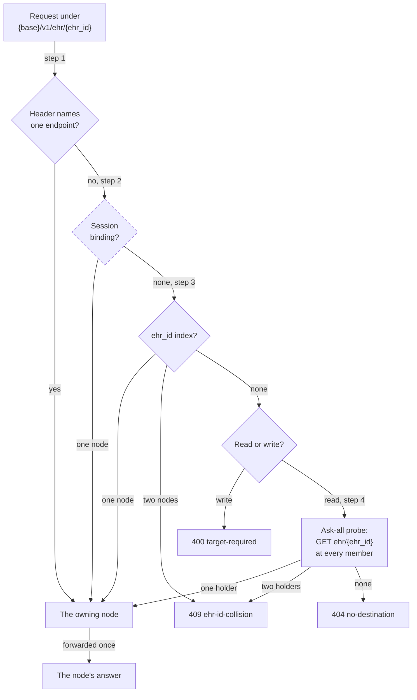
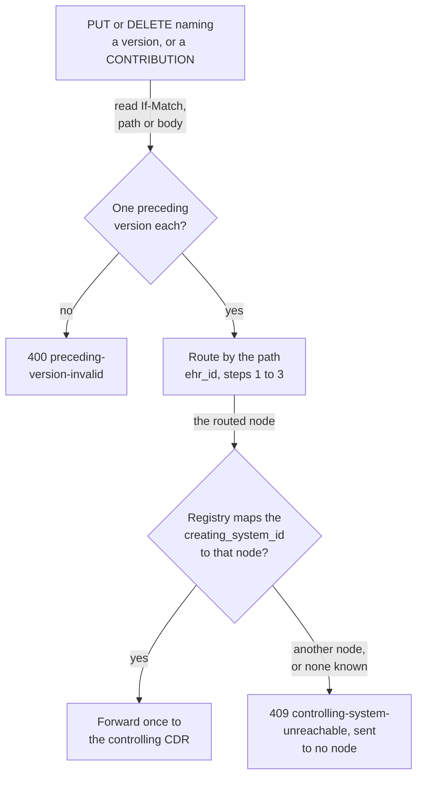
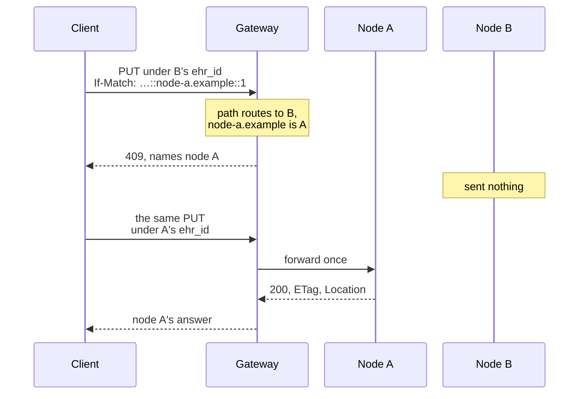
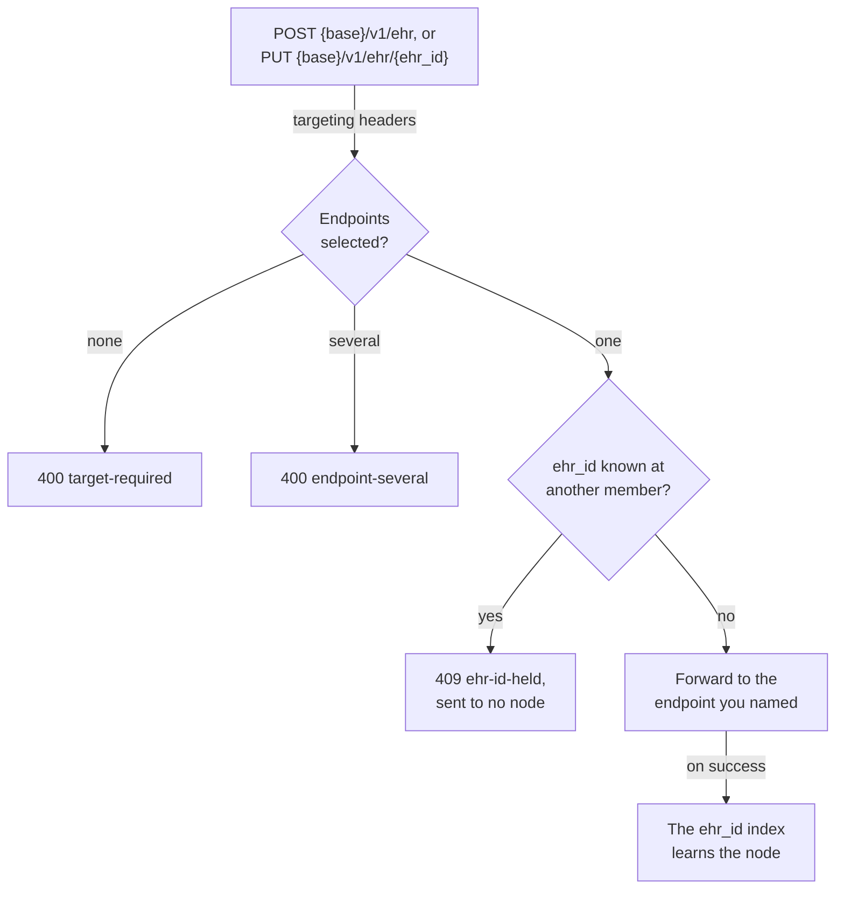

<!-- SPDX-FileCopyrightText: Vernum Projecten B.V. -->
<!-- SPDX-License-Identifier: BUSL-1.1 -->

# Follow-ups and writes

A row of a federated answer leads to a follow-up: you read the composition,
or you commit a new version of it. Every such request goes to exactly one
node, unchanged, and its answer comes back as that node sent it (§12, N22,
N31). Four identifiers decide which node, and §12a says which one governs
which request:

| You want to | The key that routes it |
|---|---|
| send a request under `{base}/v1/ehr/{ehr_id}` | the `ehr_id`, through the order below (§12.5.1, N41) |
| commit a new version of an existing object | the `creating_system_id` inside the version's uid: only the CDR that created it may take the write (§12.4, N23) |
| create a new EHR | the endpoint you name, and nothing else (§12.4, N23) |
| know which node gave you a row | the row's `endpoint_id` (§9.3) |

## Routing a path `ehr_id`

An `ehr_id` carries no system component, so a path that names one does not
say which node holds the EHR (§12.5). The gateway asks four sources in a
fixed order and stops at the first that names exactly one node (§12.5.1,
N41, CP-33). It never chooses between two claimants (§12.5.2, N42).

- **Step 1** is the one you should use: the row you act on carried its
  `endpoint_id`, so name it in `openEHR-federation-endpoint` (§12.5.1).
- **Step 2**, the resolution binding your session's query left behind, needs
  a client session. The caller is verified, and bindings per verified caller
  are planned ([#412](https://github.com/FerroHEALTH/FerroFED/issues/412));
  until then the index of step 3 carries what a resolution teaches.
- **Step 3**, the `ehr_id` index, is in memory and learns from resolutions
  and from the nodes' successful answers. A miss costs one fallback step,
  never a wrong route.
- **Step 4**, the probe, runs for reads only, and only for an `ehr_id` that
  is a bare UUID (§5.4.1). A member that fails or times out during the probe
  fails the read `424` or `504`, because the owner is then unknown. Two
  holders also raise an integrity incident for the operator (N42).

A read of one version, such as
`GET {base}/v1/ehr/{ehr_id}/composition/{uid}`, routes by its path `ehr_id`
the same way, never by the version's `creating_system_id`, because an
EHR-scoped request is routed on its `ehr_id` (§12a.1).

## A versioned write

A versioned write amends a version that exists. It routes by its path
`ehr_id` through steps 1 to 3, never through the probe, and is then held to
the version it names: the registry must map that version's
`creating_system_id` to the routed node (§12.4, §12a.1, N23, CP-15).

A route the gateway learned from answers never makes a node the controller,
because a node that holds versions of a system need not have created them
(§12.2). The sequence below is the hazard of §10.3: node A created a
composition, node B holds an imported copy, and de-duplication kept node A's
row (N36, CP-29).

The gateway refuses without asking node A, so the refusal holds while node A
is down too. It never falls back to writing at the copy.

## Creating an EHR

A new EHR has no owner yet, so it goes only where you send it (§12.4, N23).
A `PUT` that chooses its own `ehr_id` is checked against what the gateway
already knows, so one `ehr_id` never lands at two members (§12.5.2).

Two creates of one `ehr_id` that race past the check both reach their nodes.
The second to succeed raises the index-insert alarm of §12b.2, and from then
on a request for that `ehr_id` must name its endpoint.

The [follow-ups](../integrate/follow-ups.md) page lists every header, code and
case.
