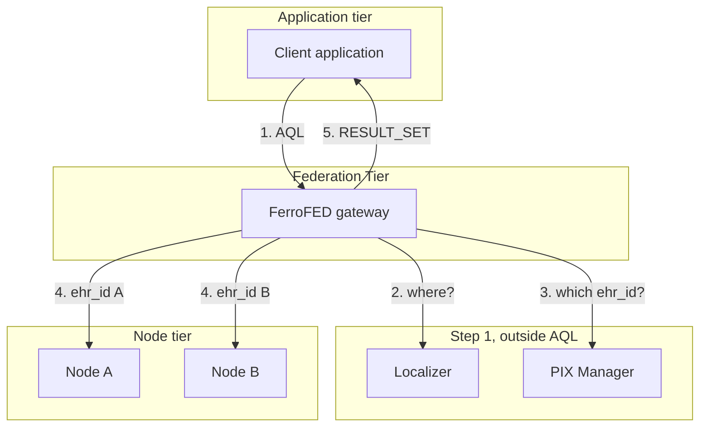
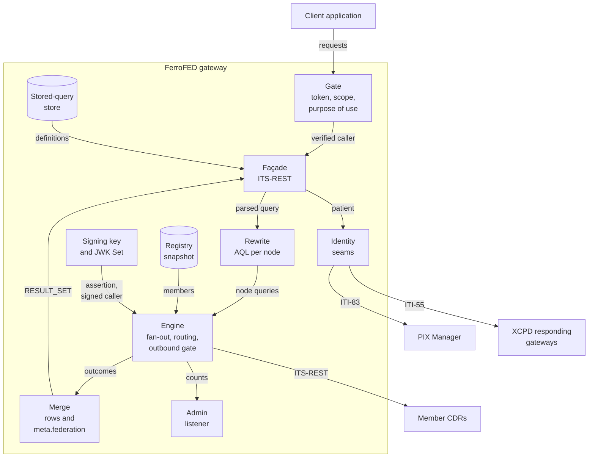

<!-- SPDX-FileCopyrightText: Vernum Projecten B.V. -->
<!-- SPDX-License-Identifier: BUSL-1.1 -->

# How it works

This part of the book explains the gateway in diagrams, one question per
page. Each diagram cites the section of the Federation Tier specification
it shows, and its requirements (N) or conformance points (CP). Each one
shows what is built on `main`. A part drawn with a dashed border is planned,
and the text names its issue and milestone.

| Page | The question it answers |
|---|---|
| [A federated query, end to end](federated-query.md) | What happens between your AQL and the merged answer? |
| [Where the patient identifier stops](identifier-hygiene.md) | How does the gateway keep the patient identifier away from every node? |
| [Follow-ups and writes](follow-ups-and-writes.md) | How does a read or a write find the one node that owns the record? |
| [Definitions and stored queries](definitions.md) | Where do templates and stored queries live? |
| [Trust and keys](trust-and-keys.md) | Who signs what, and who trusts which key? |
| [Deployment](deployment.md) | What runs beside the gateway, in the quickstart and in production? |

## The gateway between clients and member CDRs

The specification puts a Federation Tier between the applications and the
member CDRs (§3.1). A client sends it ordinary AQL over openEHR ITS-REST and
reads one ordinary `RESULT_SET` back (N1, N17). Before anything is sent to
a node, the gateway resolves the patient outside AQL, through services of
its own tier (§4.1, N3). Each node then receives standard AQL scoped to its
own `ehr_id` and never learns that it is part of a federation (N7). The
diagram follows the three tiers of the specification's own figure in §3.1.

Step 2 is optional. Under `federation.node_selection = "ask-all"` every
registry member is a candidate, and the gateway asks the PIX Manager about
all of them (§4.3, N4). Under `"localized"` a localizer names the candidates
first (§14.1). Four localizers are built: IHE XCPD ITI-55 (Annex A.3), the
NVI of the Dutch binding (Annex B §B.1), the PIX Manager itself, whose one
ITI-83 answer both localizes and resolves (§14.2), and the development
cross-reference.

## The parts of the gateway

The second diagram opens the gateway box. The names in it are the names
every other page of this part uses.

- **Gate:** verifies the caller's access token against the issuers you
  trust, and checks the operation's scope and the purpose of use before
  anything else reads the request (§13.1, N25). A refused request reaches no
  node ([Trust and keys](trust-and-keys.md)).
- **Façade:** serves the ITS-REST surface the client sees, from the
  generated route tables of `openehr-its` (§7a, N1). It takes the query
  apart, picks the path a request takes, and writes the answer.
- **Rewrite:** parses the AQL with `openehr-query`, finds the patient on
  both carriers, and prints one standard query per node with
  `printer::to_aql` (§7.1, N2, N7). It refuses a query it cannot reduce
  safely (§5.4.3).
- **Identity seams:** one trait per role of §5.2, §13.2.1 and §14: the
  resolver (the PIX Manager over ITI-83, or a static cross-reference for
  trials), the localizer (XCPD over ITI-55, the Dutch NVI, the PIX Manager,
  or the static cross-reference), the consent pre-filter, and the optional
  demographics step ahead of them (a PDQm Supplier over ITI-78 or ITI-119,
  Annex A §A.2). The pre-filter has a
  development binding and a production binding, the Dutch Mitz
  ([Dutch consent](../operate/consent.md#dutch-consent-nl_gfmitz)).
- **Engine:** sends one request per node under one deadline (§11.5, N38),
  routes a follow-up to the node that owns it (§12), and passes every
  outbound request through the outbound gate (§5.4.1, N33). Each request
  carries the node's own credential and the caller's identity, signed by the
  gateway for that node (§13.1, N24, N25).
- **Signing key and JWK Set:** the gateway's ES384 key signs its client
  assertions to each node's token endpoint and the caller's identity on every
  node request. Its public half is served at `{base}/.well-known/jwks.json`
  (§13.1, N30).
- **Merge:** orders, de-duplicates and cuts the rows across nodes, and
  reports every member with its status (§9 to §11, N13, N16, N37, N39).
- **Registry snapshot:** the members you admitted, read from a reviewed
  document or an mCSD care services directory into an immutable snapshot,
  and the follow-up routing table (§12b, §15.1, N21).
- **Stored-query store:** the definitions the gateway holds when you offer
  the stored-query registry (§12.7, N44).
- **Admin listener:** a second listener for your operators only: the
  metrics and the stored-query repair. No client of the federation reaches
  it.

## What the gateway holds, and what it does not

The gateway holds no clinical data. The specification is silent on storage,
so where each piece of state lives is FerroFED's own design.

| State | Where it lives | Survives a restart |
|---|---|---|
| Organisations, nodes, endpoints, `system_id`s and `creating_system_id` mappings | the registry document you review, or the mCSD directory, loaded into a snapshot | yes, it is your file or your directory |
| `ehr_id` to node index | memory, bounded, least recently used out first | no |
| `creating_system_id` routes learned from answers | memory | no |
| Resolution bindings per verified caller | memory, under a lifetime and a capacity | no |
| Access tokens from the nodes' token endpoints | memory, per endpoint, until 30 seconds before each expires | no |
| Stored-query definitions | `redb`, PostgreSQL or read-only files | yes |
| Outbound credentials and the signing keys | one secret file each | yes, they are your files |

It never writes a patient identifier, a value derived from one, or a result
row to disk. A stored query names its patient through a `$parameter`, and a
definition with a literal patient identifier is refused (§5.4.1, N33).
