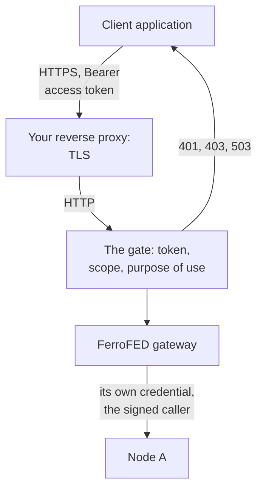
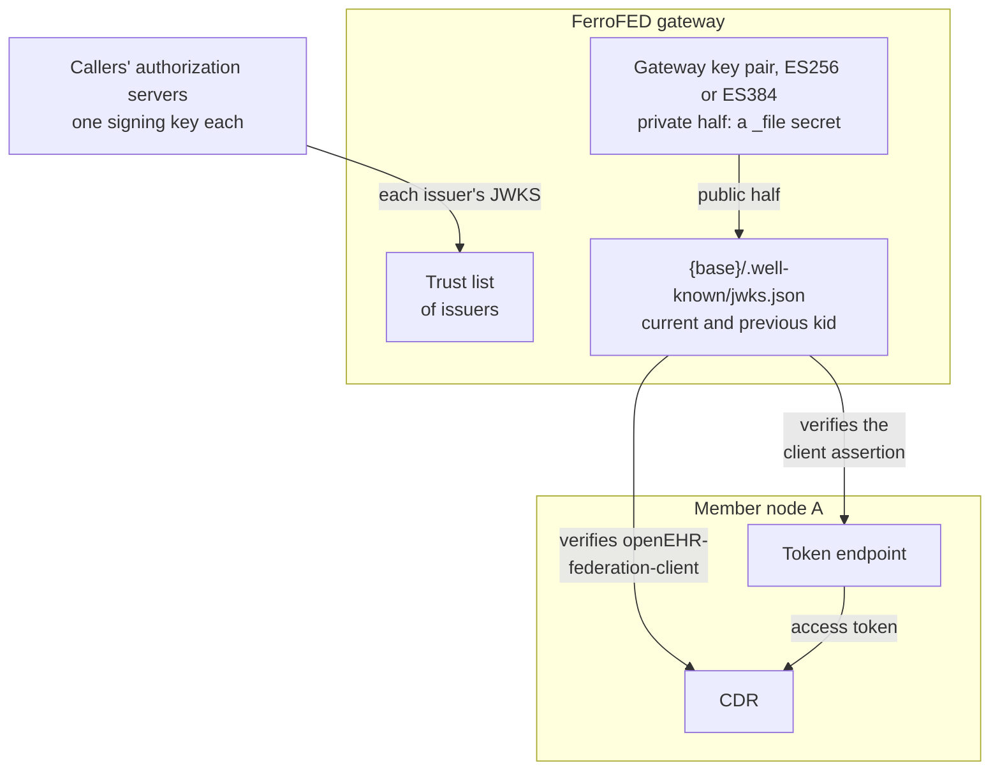
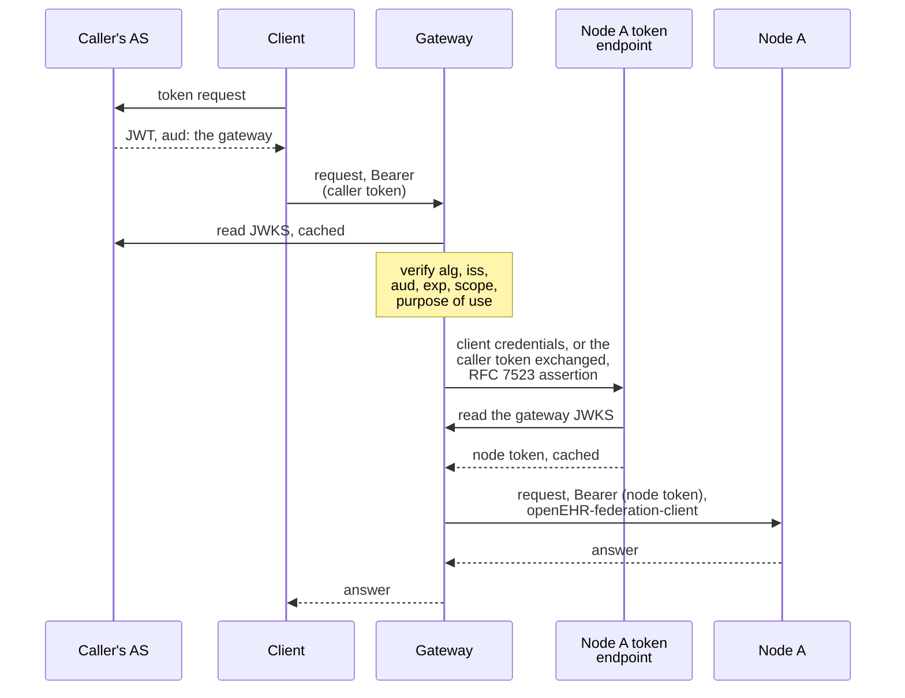

<!-- SPDX-FileCopyrightText: Vernum Projecten B.V. -->
<!-- SPDX-License-Identifier: BUSL-1.1 -->

# Trust and keys

The gateway stands in two trust relationships. Callers trust it with their
access tokens, and the nodes trust it to say who is asking. The
specification requires both: the client authenticates to the gateway, the
gateway authenticates onward to each node, and the client's identity
travels with every request (§13.1, N24, N25, CP-16, CP-17).

All three are built on `main` for v0.0.8: client authentication
([#80](https://github.com/FerroHEALTH/FerroFED/issues/80)), OAuth 2.0 to
each node with the gateway's own key
([#81](https://github.com/FerroHEALTH/FerroFED/issues/81)) and the caller's
identity conveyed to each node
([#82](https://github.com/FerroHEALTH/FerroFED/issues/82)), with token
exchange per caller and `DPoP`-bound tokens where a node asks for them
([#439](https://github.com/FerroHEALTH/FerroFED/issues/439)).

## The gate

Every request to the ITS-REST surface, and `OPTIONS {base}/`, passes the
gate before anything else reads it: the caller's access token is verified,
the operation's scope and the purpose of use are checked, and a refused
request reaches no node ([Client authentication](../operate/authentication.md)).

A caller's `Authorization` header never reaches a node. A proxy that
authenticates callers itself uses the explicit edge mode, signing an
assertion the gate verifies. Each onward credential is a file named by a
`_file` key, sent only to its own endpoint.

## Two trust relationships

- **Callers to the gateway** ([#80](https://github.com/FerroHEALTH/FerroFED/issues/80)):
  each calling organisation's authorization server signs its own access
  tokens. The gateway keeps a trust list of issuers and reads each issuer's
  JWKS, so it holds many public key sets and no caller's private key.
- **The gateway to each node** ([#81](https://github.com/FerroHEALTH/FerroFED/issues/81),
  §13.1, N25, N30): the gateway has one key pair of its own, on P-256
  (ES256) or P-384 (ES384). A deployment whose nodes hold to the FAPI 2.0
  Security Profile uses P-256, since that profile admits ES256 and not
  ES384 (§5.4.1). The private half is a secret file; the public half is
  published at
  `{base}/.well-known/jwks.json` and declared as `federation.auth.jwks_uri`
  in `OPTIONS {base}/`, so a node finds it without an out-of-band arrangement
  (§13.1 `jwks-discovery`). A rotation keeps the current and the previous
  `kid` in the set for one overlap window. The gateway needs no node's key
  for this.
- **The identity sent to the node** ([#82](https://github.com/FerroHEALTH/FerroFED/issues/82)):
  the `openEHR-federation-client` header is a JWS signed with the same
  gateway key, so the node verifies it against the same JWKS.

## The token flow

**Checking the caller** ([#80](https://github.com/FerroHEALTH/FerroFED/issues/80)).
The access token is a JWT (RFC 9068), checked against the issuer's JWKS,
and every check fails closed. The issuer must be on the trust list, and the
algorithm on an allow-list (ES256, ES384, PS256, RS256), so `none` and HMAC
are refused (RFC 8725). The audience must name this gateway, and the token
must not have expired. Any of those is a `401`. The scopes are read in the
SMART on openEHR grammar with `openehr-sdt`, and a token without a scope
that covers the operation is a `403`. A token without a purpose of use is a
`403` too, unless your deployment declares it optional (§13.4). For a
deployment whose proxy already authenticates callers, the edge mode is
configured explicitly: the proxy signs an assertion of the caller, the
gateway verifies it like a token and records which identity the proxy
asserted. A `patient/` scope grants nothing at the gateway, because no
token claim defines the patient in a form the gateway can confine across
nodes, unless the deployment binds the token's issuer to one member. The
gateway then resolves the token's `ehrId` as an identifier of that member
through the cross-reference service (§5.2), sends only to the patient's own
`{node, ehr_id}` pairs, and tells each node the patient's `ehr_id` there
([Patient grants](../operate/authentication.md#patient-grants)).

**Authenticating to the node** ([#81](https://github.com/FerroHEALTH/FerroFED/issues/81),
§13.1, N25). The gateway sends the node's token endpoint an OAuth 2.0 client
credentials request with a client assertion of RFC 7523 §2.2. The assertion
lives 300 seconds at most, carries a unique `jti`, and names the node's
token endpoint as its audience. The token endpoint verifies it against the
gateway's JWKS and issues an access token. The gateway caches that token
per node until 30 seconds before it expires, and drops it on a `401`. A
token it cannot obtain fails that node `node-error`; the gateway never
sends a request without one.

**A token per caller, and a token bound to a key**
([#439](https://github.com/FerroHEALTH/FerroFED/issues/439)). Where a node's
authorization server supports token exchange (RFC 8693), the gateway asks
it for a token per verified caller instead: the caller's token is the
subject, a second assertion of the gateway the actor, the node the
resource (RFC 8707), and the scope only the caller's scopes that cover the
operation (N26). The node then sees the caller in its own token as well as
in the signed statement below. A caller the edge asserted has no token of
its own, so that node fails `node-error` with nothing sent. Where a
deployment requires sender-constrained tokens, a grant binds its tokens to
a key of the gateway's with `DPoP` (RFC 9449): every request to that node
and its token endpoint carries a proof of the key over its method and URL,
and a node that demands a nonce is answered once more with it.

**Telling the node who asks** ([#82](https://github.com/FerroHEALTH/FerroFED/issues/82),
N24, §12.4). Every request to a node carries `openEHR-federation-client`: a
query, a routed read or write, a definition request, the ask-all probe and
the read of an EHR by subject alike. It is a JWS signed with the
gateway key, ES256 or ES384 as the key's curve says, typed
`openehr-federation-client+jwt`, that lives 60 seconds,
addressed (`aud`) to that node's endpoint id. It names the verified caller
(`sub`) and its issuer (`iss_upstream`), how the gateway verified it
(`verified_by`, `edge` for an identity the edge asserted), the caller's
organisation, the purpose of use and the caller's scopes as granted. It
never carries a patient identifier (N33): the outbound gate reads every
caller claim, and a request whose claims would carry the identifier the
query was resolved on is refused before it is sent. A request that reaches
the dispatcher with no verified caller is a `500`, with nothing sent. The
gateway's own requests for its operator, the admission check and the
redistribution of a held stored query, name the gateway itself as `sub`.
The specification leaves end-user conveyance open (§13.1), so the header
and its claims are FerroFED's own; a node verifies it as
[Client authentication](../operate/authentication.md#verifying-it-at-the-node)
describes.

## The caller's token is never forwarded

The caller's token was issued for the gateway: its audience is the gateway.
Forwarding it would hand every node a credential that unlocks every other
member that accepts the same issuer (RFC 9700 §2.3), and a node could replay
it at its neighbours. So the gateway authenticates to each node as itself,
with a token the node's own authorization server issued, and conveys the
caller as a signed statement the node can verify. Under token exchange the
caller's token reaches the node's authorization server, which exchanges it,
and never the node. It never asks a node for more than the caller holds: the
caller's scopes are enforced at the gateway and conveyed, so the node applies
them too, and an exchanged token is asked for only the scopes that cover the
operation (N26). Consent stays the node's decision either way (§13.2, N27).

The §13.4 decisions a deployment must publish, such as which identity is
verified across each boundary and who authenticates the end user, are
answered for the gateway, with a template for the rest, in
[The §13.4 deployment decisions](../operate/deployment-decisions.md)
([#84](https://github.com/FerroHEALTH/FerroFED/issues/84), CP-39).

The Nuts track of the Dutch binding (Annex B §B.4) is built: an endpoint
whose `[credentials]` name a `nuts` grant obtains its token with a
Verifiable Presentation of the gateway's credentials, bound to a key of the
gateway's with `DPoP` ([The Nuts grant](../operate/onward-credentials.md#the-nuts-grant-annex-b-b4),
[#88](https://github.com/FerroHEALTH/FerroFED/issues/88)). So is the
harmonised BgZ and eOverdracht track (Annex B §B.4a): an endpoint whose
`[credentials]` name a `fapi2` grant discovers an authorization server
under the FAPI 2.0 Security Profile, authenticates with an ES256
`private_key_jwt` assertion naming its issuer, sends the configured Rich
Authorization Requests `authorization_details`, and binds its token with
`DPoP` ([The FAPI 2.0 grant](../operate/onward-credentials.md#the-fapi-20-grant-annex-b-b4a),
[#497](https://github.com/FerroHEALTH/FerroFED/issues/497)).
